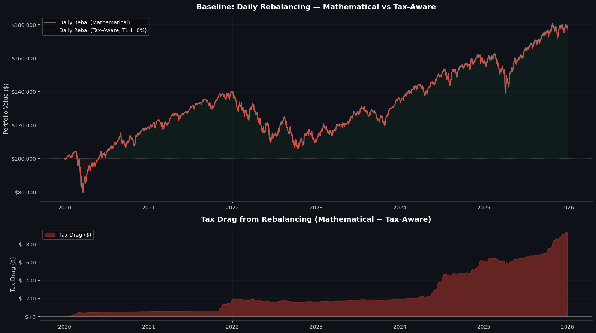
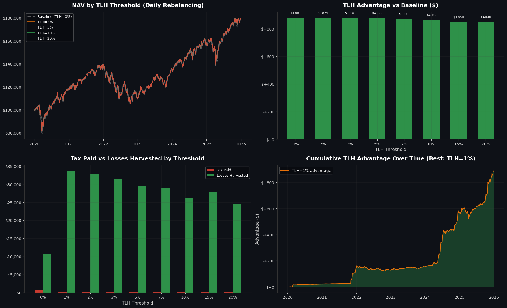
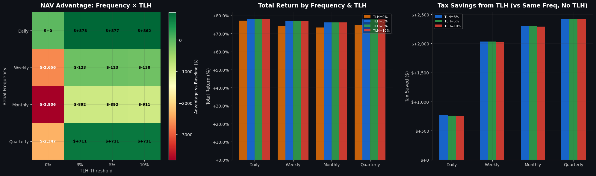
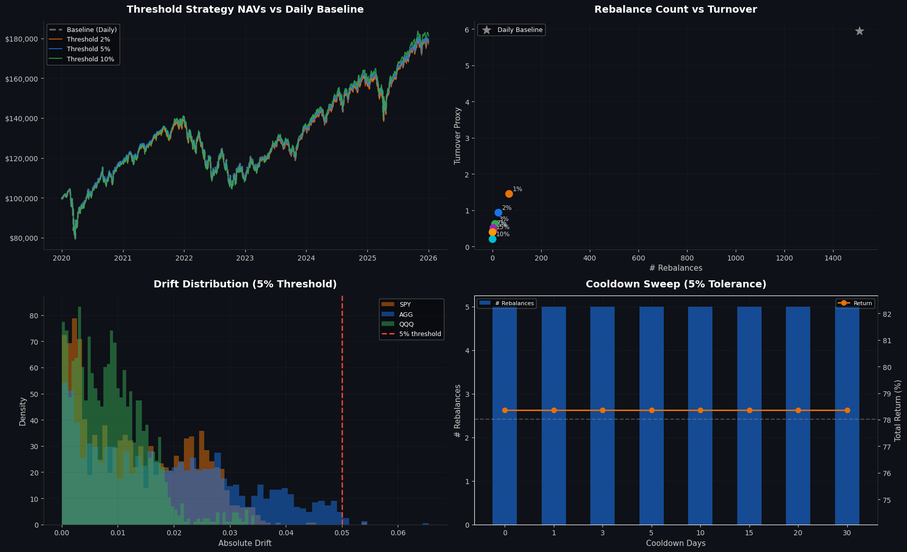
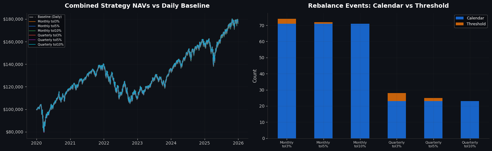
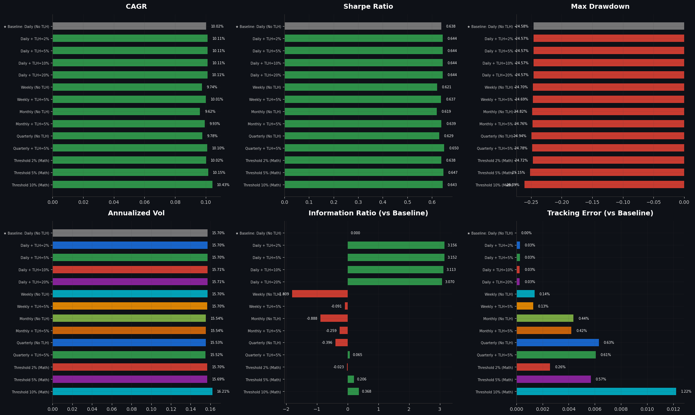
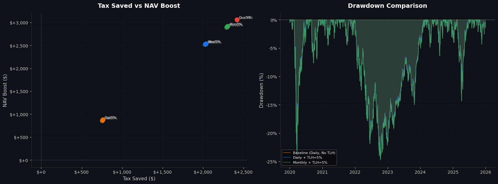
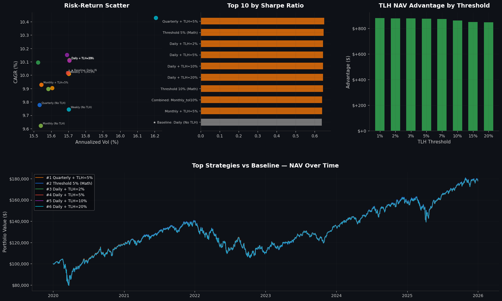

# 📊 Portfolio Returns Engine — Comprehensive Backtest
### UTexas MSBA // VISE

---

### Thesis & Baseline

The central question this backtest answers: **How much value does tax-loss harvesting (TLH) add on top of a disciplined rebalancing strategy?**

**Baseline**: Daily rebalancing to maintain target weights, *without* TLH. This represents the "naive but disciplined" investor — they keep their portfolio on target every day but ignore tax optimization opportunities. This is the right benchmark because:

1. Buy-and-hold is not a realistic baseline for TLH analysis — you can't harvest losses if you're never trading
2. Daily rebalancing provides the tightest possible weight maintenance, giving TLH the fairest test — any outperformance by TLH strategies is genuine alpha from tax management, not from better weight maintenance
3. It isolates the TLH contribution: every strategy below uses the same rebalancing logic + adds TLH on top

**What we measure against this baseline:**

| # | Section | Description |
|---|---------|-------------|
| 1 | **Setup & Data** | Load price/dividend data, define portfolio, configure parameters |
| 2 | **Baseline: Daily Rebalancing (No TLH)** | Tax-aware daily rebalancing without harvesting — our benchmark |
| 3 | **TLH Threshold Sweep** | Same daily rebalancing + TLH at various thresholds (1%–20%) |
| 4 | **Rebalancing Frequency × TLH** | How does rebalancing frequency interact with TLH effectiveness? |
| 5 | **Threshold (Drift-Band) Rebalancing + TLH** | V4 drift-band engine with TLH overlay |
| 6 | **Combined Calendar + Threshold + TLH** | Hybrid strategies — full interaction analysis |
| 7 | **Performance Metrics Deep Dive** | All strategies head-to-head: CAGR, Sharpe, drawdowns, tax savings |
| 8 | **Tax Savings Analysis** | The core deliverable: realized losses harvested, taxes saved, net benefit |
| 9 | **Turnover & Cost Analysis** | Does TLH's extra trading eat into its tax benefit? |
| 10 | **Sensitivity Analysis** | Parameter sweeps: TLH threshold, tolerance bands, cooldown |
| 11 | **Summary & Conclusions** | Final ranking, key takeaways, TLH value quantification |

---


## 1. Setup & Data Loading


```python
import pandas as pd
import numpy as np
import matplotlib.pyplot as plt
import matplotlib.ticker as mticker
from matplotlib.gridspec import GridSpec
from scipy import stats as sp_stats
from datetime import datetime, timedelta
from typing import Dict, List, Tuple, Optional, Set
from pathlib import Path
import warnings
import time

warnings.filterwarnings("ignore")
plt.style.use('dark_background')

# VISE color palette
COLORS = {
    'primary': '#e8710a', 'secondary': '#1a73e8', 'green': '#34a853',
    'red': '#ea4335', 'gray': '#888888', 'light_gray': '#cccccc',
    'bg': '#0e1117', 'card_bg': '#1a1d23', 'purple': '#9c27b0', 'cyan': '#00bcd4',
}
STRATEGY_COLORS = ['#e8710a', '#1a73e8', '#34a853', '#ea4335', '#9c27b0', '#00bcd4', '#ff9800', '#8bc34a']

def vise_style(ax, title=None, xlabel=None, ylabel=None):
    ax.set_facecolor('#0e1117')
    ax.figure.set_facecolor('#0e1117')
    ax.tick_params(colors='#cccccc', which='both')
    for spine in ['top', 'right']: ax.spines[spine].set_visible(False)
    for spine in ['bottom', 'left']: ax.spines[spine].set_color('#333333')
    if title: ax.set_title(title, color='white', fontsize=14, fontweight='bold', pad=12)
    if xlabel: ax.set_xlabel(xlabel, color='#cccccc', fontsize=11)
    if ylabel: ax.set_ylabel(ylabel, color='#cccccc', fontsize=11)
    ax.grid(True, alpha=0.15, color='#444444')

print("✅ Libraries loaded.")

```

    ✅ Libraries loaded.


```python
# ══════════════════════════════════════════════════════════════════════════════
# DATA LOADING
# ══════════════════════════════════════════════════════════════════════════════

import gdown

DATA_PATH = Path("price_data.parquet")
FILE_ID = "REDACTED_DATA_FILE_ID"

if not DATA_PATH.exists():
    print("⬇️  Downloading price data from Google Drive...")
    gdown.download(f"https://drive.google.com/uc?id={FILE_ID}", str(DATA_PATH), quiet=False, fuzzy=True)
else:
    print(f"✅ Price data found: {DATA_PATH} ({DATA_PATH.stat().st_size / 1e6:.1f} MB)")

_REQUIRED_COLS = ["TRADINGITEMID", "TICKERSYMBOL", "PRICEDATE", "PRICECLOSE", "PRICEMID", "TRADINGITEMSTATUSID"]
raw_df = pd.read_parquet(DATA_PATH, columns=_REQUIRED_COLS)
print(f"   {len(raw_df):,} rows  |  {raw_df['PRICEDATE'].min()} → {raw_df['PRICEDATE'].max()}  |  {raw_df['TICKERSYMBOL'].nunique():,} tickers")

```

    ✅ Price data found: price_data.parquet (84.6 MB)
       2,430,383 rows  |  1980-06-23 → 2026-01-30  |  711 tickers


```python
# ══════════════════════════════════════════════════════════════════════════════
# DATA PREPARATION
# ══════════════════════════════════════════════════════════════════════════════

def prepare_price_data(df, price_field="PRICECLOSE"):
    df = df.copy()
    df["PRICEDATE"] = pd.to_datetime(df["PRICEDATE"], errors="coerce")
    df = df.dropna(subset=["PRICEDATE"])
    if "TRADINGITEMSTATUSID" in df.columns:
        df = df[df["TRADINGITEMSTATUSID"].isin([1, 15])].copy()
    df[price_field] = pd.to_numeric(df[price_field], errors="coerce")
    df = df.dropna(subset=[price_field])
    df["TICKERSYMBOL"] = df["TICKERSYMBOL"].astype(str).str.strip().str.upper()
    df = df.sort_values(["TICKERSYMBOL", "PRICEDATE"]).reset_index(drop=True)
    return df

df = prepare_price_data(raw_df)
print(f"✅ Cleaned: {len(df):,} rows  |  {df['TICKERSYMBOL'].nunique():,} active tickers")

# Dividend data
DIV_PATH = Path("dividend_data.csv")
div_df = None
if DIV_PATH.exists():
    div_df = pd.read_csv(DIV_PATH)
    div_df["PAYDATE"] = pd.to_datetime(div_df["PAYDATE"], errors="coerce")
    div_df["EXDATE"] = pd.to_datetime(div_df["EXDATE"], errors="coerce")
    if "TICKERSYMBOL" not in div_df.columns and "TRADINGITEMID" in div_df.columns:
        ticker_map = df[["TRADINGITEMID", "TICKERSYMBOL"]].drop_duplicates().set_index("TRADINGITEMID")["TICKERSYMBOL"].to_dict()
        div_df["TICKERSYMBOL"] = div_df["TRADINGITEMID"].map(ticker_map)
        div_df = div_df.dropna(subset=["TICKERSYMBOL"])
    print(f"✅ Dividends: {len(div_df):,} records")
else:
    print("⚠️  No dividend_data.csv — optimizer runs without dividends")

```

    ✅ Cleaned: 2,254,430 rows  |  696 active tickers
    ⚠️  No dividend_data.csv — optimizer runs without dividends


### 1.1 Portfolio Configuration


```python
# ══════════════════════════════════════════════════════════════════════════════
# PORTFOLIO CONFIGURATION — EDIT THESE
# ══════════════════════════════════════════════════════════════════════════════

TICKERS = ["SPY", "AGG", "QQQ"]
WEIGHTS = [0.50, 0.30, 0.20]

START_DATE = "2020-01-01"
END_DATE   = "2025-12-31"

INITIAL_CAPITAL = 100_000.0
PRICE_FIELD = "PRICECLOSE"

# Tax parameters
TAX_RATES = {"st_rate": 0.35, "lt_rate": 0.20}

# ══════════════════════════════════════════════════════════════════════════════

def validate_weights(tickers, weights, tolerance=0.05):
    if len(tickers) != len(weights): raise ValueError("Length mismatch.")
    if any(w < 0 for w in weights): raise ValueError("Negative weights.")
    combined = {}
    for t, w in zip(tickers, weights):
        t_upper = t.strip().upper()
        combined[t_upper] = combined.get(t_upper, 0.0) + w
    tickers_out, weights_out = list(combined.keys()), list(combined.values())
    total = sum(weights_out)
    if total == 0: raise ValueError("Zero total weight.")
    if abs(total - 1.0) > tolerance: raise ValueError(f"Weights sum to {total:.4f}.")
    weights_out = [w / total for w in weights_out]
    return tickers_out, weights_out

TICKERS, WEIGHTS = validate_weights(TICKERS, WEIGHTS)
weight_map = dict(zip(TICKERS, WEIGHTS))

# Verify tickers exist
missing = [t for t in TICKERS if t not in set(df["TICKERSYMBOL"].unique())]
if missing: raise ValueError(f"Tickers not found: {missing}")

print("=" * 60)
print("PORTFOLIO CONFIGURATION")
print("=" * 60)
for tk, wt in zip(TICKERS, WEIGHTS):
    print(f"  {tk:>6s}  →  {wt:.1%}")
print(f"  {'─' * 20}")
print(f"  Period:  {START_DATE} → {END_DATE}")
print(f"  Capital: ${INITIAL_CAPITAL:,.0f}")
print(f"  Tax:     ST={TAX_RATES['st_rate']:.0%}  LT={TAX_RATES['lt_rate']:.0%}")
print(f"\n  BASELINE: Daily rebalancing, NO tax-loss harvesting")
print("=" * 60)

```

    ============================================================
    PORTFOLIO CONFIGURATION
    ============================================================
         SPY  →  50.0%
         AGG  →  30.0%
         QQQ  →  20.0%
      ────────────────────
      Period:  2020-01-01 → 2025-12-31
      Capital: $100,000
      Tax:     ST=35%  LT=20%
    
      BASELINE: Daily rebalancing, NO tax-loss harvesting
    ============================================================


## 2. Engine Functions

All engine code extracted from the app — calendar rebalancing, threshold rebalancing, and the MSBA v1 tax-aware optimizer with lot-level accounting.


```python
# ══════════════════════════════════════════════════════════════════════════════
# SHARED UTILITIES
# ══════════════════════════════════════════════════════════════════════════════

def build_prices_wide(df, tickers, start_date, end_date, price_field="PRICECLOSE"):
    mask = (df["TICKERSYMBOL"].isin(tickers) & (df["PRICEDATE"] >= pd.Timestamp(start_date))
            & (df["PRICEDATE"] <= pd.Timestamp(end_date)))
    subset = df.loc[mask, ["TICKERSYMBOL", "PRICEDATE", price_field]].copy()
    subset = subset.drop_duplicates(subset=["TICKERSYMBOL", "PRICEDATE"])
    wide = subset.pivot(index="PRICEDATE", columns="TICKERSYMBOL", values=price_field)
    wide = wide.sort_index().ffill().bfill()
    missing = [t for t in tickers if t not in wide.columns]
    if missing: raise ValueError(f"Tickers missing: {missing}")
    return wide[tickers]


def _get_rebalance_dates(trading_dates, freq):
    dates = pd.DatetimeIndex(trading_dates)
    if len(dates) < 2: return set()
    if freq == "Daily": return set(dates[1:])
    rebal_set = set()
    if freq == "Weekly":
        prev_week, prev_year = dates[0].isocalendar()[1], dates[0].year
        for dt in dates[1:]:
            iso = dt.isocalendar()
            if iso[1] != prev_week or dt.year != prev_year:
                rebal_set.add(dt); prev_week, prev_year = iso[1], dt.year
    elif freq == "Monthly":
        prev_month, prev_year = dates[0].month, dates[0].year
        for dt in dates[1:]:
            if dt.month != prev_month or dt.year != prev_year:
                rebal_set.add(dt); prev_month, prev_year = dt.month, dt.year
    elif freq == "Quarterly":
        quarter_months = {1, 4, 7, 10}
        prev_month, prev_year = dates[0].month, dates[0].year
        for dt in dates[1:]:
            if dt.month in quarter_months and (dt.month != prev_month or dt.year != prev_year):
                rebal_set.add(dt)
            if dt.month != prev_month or dt.year != prev_year:
                prev_month, prev_year = dt.month, dt.year
    return rebal_set


def compute_strategy_metrics(daily_values, initial_capital, benchmark_values=None):
    """V4 enhanced metrics: CAGR, Sharpe, drawdown, skew, kurtosis, TE, IR."""
    n = len(daily_values)
    if n < 2:
        return {k: 0.0 for k in ["total_return","cagr","annualized_vol","sharpe","max_drawdown",
                                   "skewness","kurtosis","avg_drawdown","tracking_error","information_ratio"]}
    final = daily_values[-1]
    total_return = final / initial_capital - 1
    years = n / 252.0
    cagr = (final / initial_capital) ** (1 / years) - 1 if years > 0 and final > 0 else 0.0
    daily_rets = np.diff(daily_values) / daily_values[:-1]
    ann_vol = np.std(daily_rets, ddof=1) * np.sqrt(252) if len(daily_rets) > 1 else 0.0
    sharpe = cagr / ann_vol if ann_vol > 0 else 0.0
    running_max = np.maximum.accumulate(daily_values)
    drawdowns = (daily_values - running_max) / running_max
    max_dd = float(np.min(drawdowns))
    skewness = float(sp_stats.skew(daily_rets)) if len(daily_rets) > 2 else 0.0
    kurtosis = float(sp_stats.kurtosis(daily_rets, fisher=True)) if len(daily_rets) > 3 else 0.0
    avg_drawdown = float(np.mean(drawdowns))
    tracking_error, information_ratio = 0.0, 0.0
    if benchmark_values is not None and len(benchmark_values) == n:
        bm_rets = np.diff(benchmark_values) / benchmark_values[:-1]
        active_rets = daily_rets - bm_rets
        tracking_error = float(np.std(active_rets, ddof=1) * np.sqrt(252)) if len(active_rets) > 1 else 0.0
        if tracking_error > 1e-12:
            information_ratio = float(np.mean(active_rets) * 252) / tracking_error
    return {
        "total_return": round(total_return, 6), "cagr": round(cagr, 6),
        "annualized_vol": round(ann_vol, 6), "sharpe": round(sharpe, 4),
        "max_drawdown": round(max_dd, 6), "skewness": round(skewness, 4),
        "kurtosis": round(kurtosis, 4), "avg_drawdown": round(avg_drawdown, 6),
        "tracking_error": round(tracking_error, 6), "information_ratio": round(information_ratio, 4),
    }


print("✅ Shared utilities loaded.")

```

    ✅ Shared utilities loaded.


```python
# ══════════════════════════════════════════════════════════════════════════════
# CALENDAR REBALANCING ENGINE (V3 — no tax awareness)
# ══════════════════════════════════════════════════════════════════════════════

def build_rebalanced_series(prices_wide, target_weights, initial_capital, rebalance_freq):
    """Pure calendar rebalancing — no TLH, no tax accounting. Mathematical position reset."""
    tickers = list(target_weights.keys())
    dates = prices_wide.index.tolist()
    n_days = len(dates)
    rebal_dates = _get_rebalance_dates(dates, rebalance_freq)

    shares = {tk: (initial_capital * target_weights[tk]) / prices_wide.loc[dates[0], tk] for tk in tickers}
    portfolio_values = np.empty(n_days, dtype=np.float64)
    rebalance_count = 0
    total_turnover_dollars = 0.0

    for i, dt in enumerate(dates):
        tv = {tk: shares[tk] * prices_wide.loc[dt, tk] for tk in tickers}
        total_value = sum(tv.values())
        portfolio_values[i] = total_value

        if dt in rebal_dates and total_value > 0:
            needs = any(abs(tv[tk]/total_value - target_weights[tk]) > 1e-10 for tk in tickers)
            if needs:
                rebalance_count += 1
                for tk in tickers:
                    target_val = target_weights[tk] * total_value
                    new_shares = target_val / prices_wide.loc[dt, tk]
                    total_turnover_dollars += abs(new_shares - shares[tk]) * prices_wide.loc[dt, tk]
                    shares[tk] = new_shares

    avg_pv = np.mean(portfolio_values)
    return pd.DataFrame({"Portfolio Value": portfolio_values}, index=dates), {
        "rebalance_count": rebalance_count,
        "turnover_proxy": round(total_turnover_dollars / avg_pv, 4) if avg_pv > 0 else 0.0,
        "final_value": round(portfolio_values[-1], 2),
        "total_return": round(portfolio_values[-1] / initial_capital - 1, 6),
        "total_turnover_dollars": round(total_turnover_dollars, 2),
    }


print("✅ Calendar rebalancing engine loaded.")

```

    ✅ Calendar rebalancing engine loaded.


```python
# ══════════════════════════════════════════════════════════════════════════════
# THRESHOLD (DRIFT-BAND) REBALANCING ENGINE (V4 — no tax awareness)
# ══════════════════════════════════════════════════════════════════════════════

def compute_weights(shares, prices):
    values = {tk: shares[tk] * prices[tk] for tk in shares}
    total = sum(values.values())
    return {tk: values[tk] / total for tk in shares} if total > 0 else {tk: 0.0 for tk in shares}

def compute_drift(current_weights, target_weights, drift_mode="Absolute"):
    drift = {}
    for tk in target_weights:
        w_cur, w_tgt = current_weights.get(tk, 0.0), target_weights[tk]
        drift[tk] = abs(w_cur / w_tgt - 1.0) if (drift_mode == "Relative" and w_tgt >= 1e-12) else abs(w_cur - w_tgt)
    return drift

def find_threshold_triggers(drift, tolerances):
    return [tk for tk, d in drift.items() if d > tolerances.get(tk, 0.05) + 1e-12]

def apply_rebalance_full(shares, target_weights, prices, total_value):
    turnover, new_shares = 0.0, {}
    for tk in target_weights:
        ns = (target_weights[tk] * total_value) / prices[tk] if prices[tk] > 0 else 0.0
        turnover += abs(ns - shares[tk]) * prices[tk]
        new_shares[tk] = ns
    return new_shares, turnover

def apply_rebalance_partial(shares, target_weights, tolerances, breached_tickers, prices, total_value):
    tickers = list(target_weights.keys())
    current_weights = compute_weights(shares, prices)
    breached_set = set(breached_tickers)
    remaining_budget = 1.0 - sum(target_weights[tk] for tk in breached_set)
    non_breached_sum = sum(current_weights.get(tk, 0.0) for tk in tickers if tk not in breached_set)
    desired = {}
    for tk in tickers:
        if tk in breached_set:
            desired[tk] = target_weights[tk]
        elif non_breached_sum > 1e-12:
            desired[tk] = (current_weights.get(tk, 0.0) / non_breached_sum) * remaining_budget
        else:
            desired[tk] = remaining_budget / max(1, len(tickers) - len(breached_set))
    turnover, new_shares = 0.0, {}
    for tk in tickers:
        ns = (desired[tk] * total_value) / prices[tk] if prices[tk] > 0 else 0.0
        turnover += abs(ns - shares[tk]) * prices[tk]
        new_shares[tk] = ns
    return new_shares, turnover

def build_threshold_rebalanced_series(
    prices_wide, target_weights, initial_capital, tolerances,
    drift_mode="Absolute", rebalance_action="Full", cooldown_days=0,
    calendar_freq=None, enable_calendar=False, enable_threshold=True):
    """V4 combined calendar+threshold engine. No tax awareness."""
    tickers = list(target_weights.keys())
    dates = prices_wide.index.tolist()
    n_days = len(dates)
    calendar_dates = _get_rebalance_dates(dates, calendar_freq) if enable_calendar and calendar_freq and calendar_freq != "None" else set()
    shares = {tk: (initial_capital * target_weights[tk]) / prices_wide.loc[dates[0], tk] for tk in tickers}
    portfolio_values = np.empty(n_days, dtype=np.float64)
    drift_history = {tk: [] for tk in tickers}
    event_log = []
    rebalance_count = calendar_rebal_count = threshold_rebal_count = 0
    total_turnover_dollars = 0.0
    cooldown_remaining = 0
    pending_breach, pending_tickers, pending_max = False, [], 0.0

    for i, dt in enumerate(dates):
        prices_today = {tk: float(prices_wide.loc[dt, tk]) for tk in tickers}
        total_value = sum(shares[tk] * prices_today[tk] for tk in tickers)
        portfolio_values[i] = total_value
        current_weights = compute_weights(shares, prices_today)
        drift = compute_drift(current_weights, target_weights, drift_mode)
        for tk in tickers: drift_history[tk].append(drift.get(tk, 0.0))
        did_rebalance = False

        if pending_breach and enable_threshold and i > 0:
            if cooldown_remaining <= 0 and total_value > 0:
                fn = apply_rebalance_full if rebalance_action == "Full" else apply_rebalance_partial
                args = (shares, target_weights, prices_today, total_value) if rebalance_action == "Full"                        else (shares, target_weights, tolerances, pending_tickers, prices_today, total_value)
                new_shares, turnover = fn(*args)
                shares = new_shares; total_turnover_dollars += turnover
                rebalance_count += 1; threshold_rebal_count += 1; did_rebalance = True
                cooldown_remaining = cooldown_days
                total_value = sum(shares[tk] * prices_today[tk] for tk in tickers)
                portfolio_values[i] = total_value
                event_log.append({"date": dt, "reason": "threshold", "turnover": round(turnover, 2)})
            pending_breach, pending_tickers, pending_max = False, [], 0.0

        if enable_calendar and dt in calendar_dates and total_value > 0:
            cw = compute_weights(shares, prices_today)
            if any(abs(cw.get(tk, 0) - target_weights[tk]) > 1e-10 for tk in tickers):
                new_shares, turnover = apply_rebalance_full(shares, target_weights, prices_today, total_value)
                shares = new_shares; total_turnover_dollars += turnover
                if not did_rebalance: rebalance_count += 1
                calendar_rebal_count += 1
                total_value = sum(shares[tk] * prices_today[tk] for tk in tickers)
                portfolio_values[i] = total_value
                event_log.append({"date": dt, "reason": "calendar", "turnover": round(turnover, 2)})

        if enable_threshold and i < n_days - 1:
            cw_post = compute_weights(shares, prices_today)
            drift_post = compute_drift(cw_post, target_weights, drift_mode)
            breached = find_threshold_triggers(drift_post, tolerances)
            if breached and cooldown_remaining <= 0:
                pending_breach, pending_tickers = True, breached
                pending_max = max(drift_post[tk] for tk in breached)

        if cooldown_remaining > 0: cooldown_remaining -= 1

    avg_pv = np.mean(portfolio_values)
    event_log_df = pd.DataFrame(event_log) if event_log else pd.DataFrame(columns=["date","reason","turnover"])
    return pd.DataFrame({"Portfolio Value": portfolio_values}, index=dates), {
        "rebalance_count": rebalance_count, "calendar_rebal_count": calendar_rebal_count,
        "threshold_rebal_count": threshold_rebal_count,
        "turnover_proxy": round(total_turnover_dollars / avg_pv, 4) if avg_pv > 0 else 0.0,
        "final_value": round(portfolio_values[-1], 2),
        "total_return": round(portfolio_values[-1] / initial_capital - 1, 6),
        "total_turnover_dollars": round(total_turnover_dollars, 2),
    }, event_log_df, drift_history


print("✅ Threshold rebalancing engine loaded.")

```

    ✅ Threshold rebalancing engine loaded.


```python
# ━━━━━━━━━━━━━━━━━━━━━━━━━━━━━━━━━━━━━━━━━━━━━━━━━━━━━━━━━━━━━━━
# MSBA v1 TAX-AWARE OPTIMIZER (lot-level accounting, TLH, tax-optimal disposal)
# ━━━━━━━━━━━━━━━━━━━━━━━━━━━━━━━━━━━━━━━━━━━━━━━━━━━━━━━━━━━━━━━

class TaxEngine:
    def __init__(self, st_rate, lt_rate, lt_holding_days=365):
        self.st_rate, self.lt_rate, self.lt_days = st_rate, lt_rate, lt_holding_days
        self.st_loss_cf, self.lt_loss_cf = 0.0, 0.0

    def classify(self, open_date, close_date):
        days = (close_date - open_date).days
        return ("LT", self.lt_rate) if days >= self.lt_days else ("ST", self.st_rate)

    def compute_tax(self, gain, gain_type):
        if gain < 0:
            if gain_type == "ST": self.st_loss_cf += abs(gain)
            else: self.lt_loss_cf += abs(gain)
            return 0.0
        if gain == 0: return 0.0
        taxable = gain
        if gain_type == "ST":
            used = min(taxable, self.st_loss_cf); taxable -= used; self.st_loss_cf -= used
            used = min(taxable, self.lt_loss_cf); taxable -= used; self.lt_loss_cf -= used
            return taxable * self.st_rate
        else:
            used = min(taxable, self.lt_loss_cf); taxable -= used; self.lt_loss_cf -= used
            used = min(taxable, self.st_loss_cf); taxable -= used; self.st_loss_cf -= used
            return taxable * self.lt_rate


class Portfolio:
    def __init__(self, initial_cash, tax_engine):
        self.cash = initial_cash
        self.tax = tax_engine
        self._lot_ctr = self._trd_ctr = self._rel_ctr = 0
        self._lots, self._lots_idx, self._lot_id_map = [], {}, {}
        self._trades, self._realized, self._taxes = [], [], []
        self.total_tax_paid = 0.0
        self.total_losses_harvested = 0.0  # Track TLH value

    def _nid(self, prefix, attr):
        val = getattr(self, attr) + 1; setattr(self, attr, val)
        return f"{prefix}{val:06d}"

    def shares_held(self, ticker):
        return sum(self._lots[i]["shares"] for i in self._lots_idx.get(ticker, []) if self._lots[i]["shares"] > 1e-12)

    def _open_lots(self, ticker):
        return [self._lots[i] for i in self._lots_idx.get(ticker, []) if self._lots[i]["shares"] > 1e-12]

    def _sorted_lots_for_sell(self, ticker, price, date):
        lots = self._open_lots(ticker)
        for lot in lots:
            lot["_pnl"] = price - lot["cost_basis"]
            lot["_days"] = (date - lot["open_date"]).days
            lot["_is_loss"] = 1 if lot["_pnl"] < 0 else 0
            lot["_is_lt"] = 1 if lot["_days"] >= self.tax.lt_days else 0
        lots.sort(key=lambda x: (-x["_is_loss"], x["_is_lt"], x["_pnl"]))
        return lots

    def buy(self, date, ticker, shares, price, source="BUY"):
        cost = shares * price
        if cost > self.cash + 1e-6: shares = self.cash / price; cost = shares * price
        if shares < 1e-12: return
        self.cash -= cost
        lid = self._nid("L", "_lot_ctr")
        lot = {"lot_id": lid, "ticker": ticker, "open_date": date,
               "shares": shares, "cost_basis": price, "total_cost": cost, "source": source}
        idx = len(self._lots); self._lots.append(lot)
        self._lots_idx.setdefault(ticker, []).append(idx); self._lot_id_map[lid] = idx
        self._trades.append({"trade_id": self._nid("T", "_trd_ctr"), "trade_date": date,
            "ticker": ticker, "action": source, "price": price, "shares": shares,
            "gross_value": cost, "net_cash_impact": -cost})

    def sell(self, date, ticker, shares, price, lot_selection="TAX_OPTIMAL"):
        avail = self.shares_held(ticker)
        if shares > avail + 1e-9: shares = avail
        if shares < 1e-12: return
        proceeds_total = shares * price
        lots = self._sorted_lots_for_sell(ticker, price, date) if lot_selection == "TAX_OPTIMAL" \
               else sorted(self._open_lots(ticker), key=lambda x: x["open_date"])
        remaining = shares
        for lot in lots:
            if remaining < 1e-12: break
            sold = min(lot["shares"], remaining)
            gain_type, tax_rate = self.tax.classify(lot["open_date"], date)
            lot_proceeds, lot_cost = sold * price, sold * lot["cost_basis"]
            gain = lot_proceeds - lot_cost
            tax = self.tax.compute_tax(gain, gain_type)
            eid = self._nid("R", "_rel_ctr")
            self._realized.append({
                "event_id": eid, "event_date": date, "ticker": ticker, "event_type": "SALE",
                "shares": sold, "proceeds": lot_proceeds, "cost_basis": lot_cost,
                "gain_loss": gain, "holding_days": (date - lot["open_date"]).days,
                "gain_type": gain_type, "tax_rate": tax_rate, "tax_owed": tax, "lot_id": lot["lot_id"]})
            if tax > 0:
                self.cash -= tax; self.total_tax_paid += tax
                self._taxes.append({"date": date, "event_id": eid, "amount": tax})
            if gain < 0:
                self.total_losses_harvested += abs(gain)
            lot["shares"] -= sold; lot["total_cost"] = lot["shares"] * lot["cost_basis"]
            remaining -= sold
        self.cash += proceeds_total
        self._trades.append({"trade_id": self._nid("T", "_trd_ctr"), "trade_date": date,
            "ticker": ticker, "action": "SELL", "shares": shares, "price": price,
            "gross_value": proceeds_total, "net_cash_impact": proceeds_total})

    def process_dividend(self, date, ticker, div_per_share, price, reinvest):
        held = self.shares_held(ticker)
        if held < 1e-12: return
        self.cash += held * div_per_share
        if reinvest and price > 0:
            self.buy(date, ticker, (held * div_per_share) / price, price, source="DRIP")

    def market_value(self, prices):
        return sum(lot["shares"] * prices.get(lot["ticker"], 0.0) for lot in self._lots if lot["shares"] > 1e-12)

    def nav(self, prices): return self.market_value(prices) + self.cash
    def trades_df(self): return pd.DataFrame(self._trades) if self._trades else pd.DataFrame()
    def realized_df(self): return pd.DataFrame(self._realized) if self._realized else pd.DataFrame()


def run_optimizer_simulation(prices_df, dividends_df, tickers, weights, start_date, end_date,
                              rebalance_frequency, tax_rates, tlh_threshold, reinvest_dividends,
                              initial_capital=100_000.0, price_field="PRICECLOSE", static=False):
    start_dt, end_dt = pd.Timestamp(start_date), pd.Timestamp(end_date)
    mask = (prices_df["TICKERSYMBOL"].isin(tickers) & (prices_df["PRICEDATE"] >= start_dt)
            & (prices_df["PRICEDATE"] <= end_dt))
    sub = prices_df.loc[mask, ["TICKERSYMBOL", "PRICEDATE", price_field]].copy()
    sub = sub.drop_duplicates(subset=["TICKERSYMBOL", "PRICEDATE"])
    wide = sub.pivot(index="PRICEDATE", columns="TICKERSYMBOL", values=price_field)
    wide = wide.sort_index().ffill().bfill()[tickers]
    trading_dates = wide.index.tolist()

    div_lookup = {}
    if dividends_df is not None and not dividends_df.empty:
        ddf = dividends_df.copy()
        ddf["PAYDATE"] = pd.to_datetime(ddf["PAYDATE"], errors="coerce")
        if "TICKERSYMBOL" in ddf.columns:
            ddf["TICKERSYMBOL"] = ddf["TICKERSYMBOL"].astype(str).str.strip().str.upper()
            ddf = ddf[ddf["TICKERSYMBOL"].isin(tickers)]
            for _, row in ddf.iterrows():
                key = (row["TICKERSYMBOL"], row["PAYDATE"])
                div_lookup[key] = div_lookup.get(key, 0.0) + float(row["DIVAMOUNT"])

    rebal_dates = set() if static else (
        _get_rebalance_dates(trading_dates, rebalance_frequency) if rebalance_frequency != "None" else set())
    tax_eng = TaxEngine(st_rate=tax_rates.get("st_rate", 0.35), lt_rate=tax_rates.get("lt_rate", 0.20))
    pf = Portfolio(initial_capital, tax_eng)
    wm = dict(zip(tickers, weights))

    day0 = trading_dates[0]
    for tk in tickers: pf.buy(day0, tk, (initial_capital * wm[tk]) / wide.loc[day0, tk], wide.loc[day0, tk])
    nav_arr = np.empty(len(trading_dates), dtype=np.float64)
    nav_arr[0] = pf.nav({tk: wide.loc[day0, tk] for tk in tickers})

    for i in range(1, len(trading_dates)):
        dt = trading_dates[i]
        prices_today = {tk: wide.loc[dt, tk] for tk in tickers}
        # 1. Dividends
        for tk in tickers:
            div_amt = div_lookup.get((tk, dt))
            if div_amt and div_amt > 0:
                pf.process_dividend(dt, tk, div_amt, prices_today[tk], reinvest_dividends)
        # 2. TLH
        if tlh_threshold > 0:
            for tk in tickers:
                harvests = [(lot["lot_id"], lot["shares"]) for lot in pf._open_lots(tk)
                            if lot["shares"] > 1e-12 and
                            (prices_today[tk] - lot["cost_basis"]) / lot["cost_basis"] <= -tlh_threshold]
                for _, lot_shares in harvests:
                    pf.sell(dt, tk, lot_shares, prices_today[tk])
                    pf.buy(dt, tk, lot_shares, prices_today[tk], source="TLH_REBUY")
        # 3. Rebalancing
        if dt in rebal_dates:
            total_val = pf.nav(prices_today)
            if total_val > 0:
                for tk in tickers:
                    cur, tgt = pf.shares_held(tk) * prices_today[tk], total_val * wm[tk]
                    if cur > tgt + 1.0: pf.sell(dt, tk, (cur - tgt) / prices_today[tk], prices_today[tk])
                total_val = pf.nav(prices_today)
                for tk in tickers:
                    cur, tgt = pf.shares_held(tk) * prices_today[tk], total_val * wm[tk]
                    if tgt > cur + 1.0: pf.buy(dt, tk, (tgt - cur) / prices_today[tk], prices_today[tk])
        nav_arr[i] = pf.nav(prices_today)

    nav_series = pd.Series(nav_arr, index=trading_dates, name="NAV")
    return {
        "nav_series": nav_series, "trades_df": pf.trades_df(), "realized_df": pf.realized_df(),
        "tax_paid_total": pf.total_tax_paid, "losses_harvested": pf.total_losses_harvested,
    }


print("✅ MSBA v1 Optimizer engine loaded (with loss-harvested tracking).")
```

    ✅ MSBA v1 Optimizer engine loaded (with loss-harvested tracking).


## 3. Baseline: Daily Rebalancing Without TLH

This is our benchmark. It represents the "best possible weight maintenance" strategy — rebalance every single trading day to keep the portfolio exactly at target weights. Crucially, this version has **no tax-loss harvesting**. Everything we test below adds TLH on top.

We run two versions of this baseline:
1. **Mathematical rebalancing** (V3 engine) — position reset, no tax accounting
2. **Tax-aware rebalancing** (MSBA v1 optimizer, TLH=0%) — lot-level accounting with tax impact from rebalancing trades, but no intentional loss harvesting


```python
# ══════════════════════════════════════════════════════════════════════════════
# BUILD PRICE MATRIX
# ══════════════════════════════════════════════════════════════════════════════

prices_wide = build_prices_wide(df, TICKERS, START_DATE, END_DATE, PRICE_FIELD)
trading_dates = prices_wide.index.tolist()
print(f"Price matrix: {len(trading_dates)} trading days × {len(TICKERS)} tickers")
print(f"  {trading_dates[0].date()} → {trading_dates[-1].date()}")

```

    Price matrix: 1508 trading days × 3 tickers
      2020-01-02 → 2025-12-31


```python
# ══════════════════════════════════════════════════════════════════════════════
# BASELINE: Daily Rebalancing (Mathematical — V3 engine)
# ══════════════════════════════════════════════════════════════════════════════

baseline_daily, baseline_stats = build_rebalanced_series(
    prices_wide, weight_map, INITIAL_CAPITAL, "Daily")

BASELINE_VALUES = baseline_daily["Portfolio Value"].values
BASELINE_DATES = baseline_daily.index

print("\n" + "=" * 70)
print("BASELINE: Daily Rebalancing (No TLH)")
print("=" * 70)
print(f"  Final Value:     ${baseline_stats['final_value']:,.2f}")
print(f"  Total Return:    {baseline_stats['total_return']:+.2%}")
print(f"  Rebalance Events:{baseline_stats['rebalance_count']:,}")
print(f"  Turnover Proxy:  {baseline_stats['turnover_proxy']:.2f}x")
print(f"  Turnover $:      ${baseline_stats['total_turnover_dollars']:,.0f}")

```

    
    ======================================================================
    BASELINE: Daily Rebalancing (No TLH)
    ======================================================================
      Final Value:     $178,025.80
      Total Return:    +78.03%
      Rebalance Events:1,507
      Turnover Proxy:  5.94x
      Turnover $:      $781,910


```python
# ══════════════════════════════════════════════════════════════════════════════
# BASELINE: Daily Rebalancing (Tax-Aware — MSBA v1, TLH=0%)
# This captures the TAX COST of daily rebalancing without any harvesting
# ══════════════════════════════════════════════════════════════════════════════

baseline_taxaware = run_optimizer_simulation(
    df, div_df, TICKERS, WEIGHTS, START_DATE, END_DATE,
    rebalance_frequency="Daily", tax_rates=TAX_RATES, tlh_threshold=0.0,
    reinvest_dividends=True, initial_capital=INITIAL_CAPITAL, price_field=PRICE_FIELD, static=False,
)

BASELINE_TAXAWARE_VALUES = baseline_taxaware["nav_series"].values
bt_final = BASELINE_TAXAWARE_VALUES[-1]

print(f"\n  Tax-Aware Baseline:")
print(f"  Final NAV:       ${bt_final:,.2f}")
print(f"  Total Return:    {(bt_final / INITIAL_CAPITAL - 1):+.2%}")
print(f"  Tax Paid:        ${baseline_taxaware['tax_paid_total']:,.2f}")
print(f"  Tax Drag:        {(baseline_stats['final_value'] - bt_final):+,.2f} "
      f"({(baseline_stats['final_value'] - bt_final) / INITIAL_CAPITAL:+.2%})")
print(f"\n  ⭐ The tax-aware baseline shows the COST of rebalancing taxes.")
print(f"     TLH strategies below must overcome this drag AND add value.")

```

    
      Tax-Aware Baseline:
      Final NAV:       $177,098.67
      Total Return:    +77.10%
      Tax Paid:        $789.90
      Tax Drag:        +927.13 (+0.93%)
    
      ⭐ The tax-aware baseline shows the COST of rebalancing taxes.
         TLH strategies below must overcome this drag AND add value.


```python
# ══════════════════════════════════════════════════════════════════════════════
# BASELINE VISUALIZATION
# ══════════════════════════════════════════════════════════════════════════════

fig, axes = plt.subplots(2, 1, figsize=(16, 9), gridspec_kw={'height_ratios': [3, 1.5]})

# NAV curves
ax = axes[0]
ax.plot(BASELINE_DATES, BASELINE_VALUES, color=COLORS['gray'], linewidth=2,
        label='Daily Rebal (Mathematical)', alpha=0.9)
ax.plot(baseline_taxaware["nav_series"].index, BASELINE_TAXAWARE_VALUES,
        color=COLORS['red'], linewidth=1.5, label='Daily Rebal (Tax-Aware, TLH=0%)', alpha=0.85)
ax.fill_between(BASELINE_DATES, BASELINE_VALUES, INITIAL_CAPITAL,
                where=BASELINE_VALUES >= INITIAL_CAPITAL, alpha=0.08, color=COLORS['green'])
ax.fill_between(BASELINE_DATES, BASELINE_VALUES, INITIAL_CAPITAL,
                where=BASELINE_VALUES < INITIAL_CAPITAL, alpha=0.08, color=COLORS['red'])
ax.axhline(y=INITIAL_CAPITAL, color=COLORS['gray'], linestyle=':', linewidth=0.7, alpha=0.5)
ax.yaxis.set_major_formatter(mticker.FuncFormatter(lambda x, _: f'${x:,.0f}'))
ax.legend(fontsize=10, framealpha=0.3)
vise_style(ax, title='Baseline: Daily Rebalancing — Mathematical vs Tax-Aware', ylabel='Portfolio Value ($)')

# Tax drag
ax = axes[1]
tax_drag = BASELINE_VALUES[:len(BASELINE_TAXAWARE_VALUES)] - BASELINE_TAXAWARE_VALUES
common_dates = BASELINE_DATES[:len(BASELINE_TAXAWARE_VALUES)]
ax.fill_between(common_dates, tax_drag, 0, alpha=0.4, color=COLORS['red'], label='Tax Drag ($)')
ax.axhline(y=0, color=COLORS['gray'], linewidth=0.5)
ax.yaxis.set_major_formatter(mticker.FuncFormatter(lambda x, _: f'${x:+,.0f}'))
ax.legend(fontsize=10, framealpha=0.3)
vise_style(ax, title='Tax Drag from Rebalancing (Mathematical − Tax-Aware)', ylabel='Tax Drag ($)')

plt.tight_layout()
plt.show()

```


    

    


## 4. TLH Threshold Sweep (Daily Rebalancing)

Same daily rebalancing baseline, but now we activate TLH at various thresholds. This isolates the **pure TLH contribution** — the only variable changing is the harvesting threshold.

The TLH threshold controls the minimum unrealized loss (%) required before a lot is harvested. Lower thresholds harvest more frequently (smaller losses), while higher thresholds wait for larger drawdowns.


```python
# ══════════════════════════════════════════════════════════════════════════════
# TLH THRESHOLD SWEEP: Daily rebalancing + TLH at various thresholds
# ══════════════════════════════════════════════════════════════════════════════

TLH_THRESHOLDS = [0.0, 0.01, 0.02, 0.03, 0.05, 0.07, 0.10, 0.15, 0.20]
tlh_sweep_results = {}

print("TLH THRESHOLD SWEEP (Daily Rebalancing)")
print(f"{'TLH':>6s} | {'Final NAV':>12s} | {'Return':>8s} | {'Tax Paid':>10s} | {'Losses Harvested':>16s} | {'vs Baseline':>12s}")
print("─" * 85)

for tlh in TLH_THRESHOLDS:
    res = run_optimizer_simulation(
        df, div_df, TICKERS, WEIGHTS, START_DATE, END_DATE,
        rebalance_frequency="Daily", tax_rates=TAX_RATES, tlh_threshold=tlh,
        reinvest_dividends=True, initial_capital=INITIAL_CAPITAL, price_field=PRICE_FIELD, static=False,
    )
    tlh_sweep_results[tlh] = res
    final = res["nav_series"].iloc[-1]
    advantage = final - bt_final  # vs tax-aware baseline (TLH=0%)
    print(f"  {tlh:>5.1%} | ${final:>11,.0f} | {(final/INITIAL_CAPITAL-1):>+7.2%} | "
          f"${res['tax_paid_total']:>9,.0f} | ${res['losses_harvested']:>15,.0f} | ${advantage:>+11,.0f}")

print(f"\n  Baseline (TLH=0%): ${bt_final:>11,.0f}")

```

    TLH THRESHOLD SWEEP (Daily Rebalancing)
       TLH |    Final NAV |   Return |   Tax Paid | Losses Harvested |  vs Baseline
    ─────────────────────────────────────────────────────────────────────────────────────
       0.0% | $    177,099 | +77.10% | $      790 | $         10,627 | $         +0
       1.0% | $    177,979 | +77.98% | $       27 | $         33,630 | $       +881
       2.0% | $    177,977 | +77.98% | $       28 | $         32,866 | $       +879
       3.0% | $    177,977 | +77.98% | $       28 | $         31,384 | $       +878
       5.0% | $    177,976 | +77.98% | $       29 | $         29,613 | $       +877
       7.0% | $    177,971 | +77.97% | $       31 | $         28,811 | $       +872
      10.0% | $    177,961 | +77.96% | $       37 | $         26,271 | $       +862
      15.0% | $    177,949 | +77.95% | $       44 | $         27,819 | $       +850
      20.0% | $    177,946 | +77.95% | $       45 | $         24,386 | $       +848
    
      Baseline (TLH=0%): $    177,099


```python
# ══════════════════════════════════════════════════════════════════════════════
# TLH SWEEP VISUALIZATION
# ══════════════════════════════════════════════════════════════════════════════

fig, axes = plt.subplots(2, 2, figsize=(18, 11))

# Chart 1: NAV curves for each TLH threshold
ax = axes[0, 0]
ax.plot(baseline_taxaware["nav_series"].index, BASELINE_TAXAWARE_VALUES,
        color=COLORS['gray'], linewidth=2.5, label='Baseline (TLH=0%)', alpha=0.7, linestyle='--')
for i, tlh in enumerate([0.02, 0.05, 0.10, 0.20]):
    if tlh in tlh_sweep_results:
        nav = tlh_sweep_results[tlh]["nav_series"]
        ax.plot(nav.index, nav.values, color=STRATEGY_COLORS[i], linewidth=1.3,
                label=f'TLH={tlh:.0%}', alpha=0.85)
ax.yaxis.set_major_formatter(mticker.FuncFormatter(lambda x, _: f'${x:,.0f}'))
ax.legend(fontsize=9, framealpha=0.3)
vise_style(ax, title='NAV by TLH Threshold (Daily Rebalancing)')

# Chart 2: TLH advantage ($) vs threshold
ax = axes[0, 1]
thresholds = [t for t in TLH_THRESHOLDS if t > 0]
advantages = [tlh_sweep_results[t]["nav_series"].iloc[-1] - bt_final for t in thresholds]
colors = [COLORS['green'] if a > 0 else COLORS['red'] for a in advantages]
ax.bar(range(len(thresholds)), advantages, color=colors, alpha=0.85, width=0.6)
ax.set_xticks(range(len(thresholds)))
ax.set_xticklabels([f'{t:.0%}' for t in thresholds], color='#cccccc')
for i, (a, t) in enumerate(zip(advantages, thresholds)):
    ax.text(i, a + (max(abs(a) for a in advantages) * 0.03 * (1 if a >= 0 else -1)),
            f'${a:+,.0f}', ha='center', va='bottom' if a >= 0 else 'top', color='white', fontsize=8)
ax.axhline(y=0, color=COLORS['gray'], linewidth=0.8)
ax.yaxis.set_major_formatter(mticker.FuncFormatter(lambda x, _: f'${x:+,.0f}'))
vise_style(ax, title='TLH Advantage vs Baseline ($)', xlabel='TLH Threshold')

# Chart 3: Tax paid vs losses harvested
ax = axes[1, 0]
taxes = [tlh_sweep_results[t]["tax_paid_total"] for t in TLH_THRESHOLDS]
losses = [tlh_sweep_results[t]["losses_harvested"] for t in TLH_THRESHOLDS]
x = np.arange(len(TLH_THRESHOLDS))
w = 0.35
ax.bar(x - w/2, taxes, w, color=COLORS['red'], alpha=0.85, label='Tax Paid')
ax.bar(x + w/2, losses, w, color=COLORS['green'], alpha=0.85, label='Losses Harvested')
ax.set_xticks(x)
ax.set_xticklabels([f'{t:.0%}' for t in TLH_THRESHOLDS], color='#cccccc')
ax.yaxis.set_major_formatter(mticker.FuncFormatter(lambda x, _: f'${x:,.0f}'))
ax.legend(fontsize=9, framealpha=0.3)
vise_style(ax, title='Tax Paid vs Losses Harvested by Threshold', xlabel='TLH Threshold')

# Chart 4: Cumulative TLH advantage over time (for best threshold)
ax = axes[1, 1]
best_tlh = max(thresholds, key=lambda t: tlh_sweep_results[t]["nav_series"].iloc[-1])
best_nav = tlh_sweep_results[best_tlh]["nav_series"]
common = baseline_taxaware["nav_series"].index.intersection(best_nav.index)
advantage_ts = best_nav.loc[common].values - baseline_taxaware["nav_series"].loc[common].values
ax.fill_between(common, advantage_ts, 0,
                where=advantage_ts >= 0, alpha=0.3, color=COLORS['green'])
ax.fill_between(common, advantage_ts, 0,
                where=advantage_ts < 0, alpha=0.3, color=COLORS['red'])
ax.plot(common, advantage_ts, color=COLORS['primary'], linewidth=1.5, label=f'TLH={best_tlh:.0%} advantage')
ax.axhline(y=0, color=COLORS['gray'], linewidth=0.8)
ax.yaxis.set_major_formatter(mticker.FuncFormatter(lambda x, _: f'${x:+,.0f}'))
ax.legend(fontsize=10, framealpha=0.3)
vise_style(ax, title=f'Cumulative TLH Advantage Over Time (Best: TLH={best_tlh:.0%})', ylabel='Advantage ($)')

plt.tight_layout()
plt.show()

```


    

    


## 5. Rebalancing Frequency × TLH Interaction

Does TLH work better with daily, weekly, monthly, or quarterly rebalancing? This matrix tests the interaction between rebalancing frequency and TLH effectiveness.

The intuition: less frequent rebalancing means more drift, which means more opportunities for individual lots to accumulate losses worth harvesting. But it also means the portfolio spends more time off-target.


```python
# ══════════════════════════════════════════════════════════════════════════════
# FREQUENCY × TLH MATRIX
# ══════════════════════════════════════════════════════════════════════════════

REBAL_FREQS = ["Daily", "Weekly", "Monthly", "Quarterly"]
MATRIX_TLH = [0.0, 0.03, 0.05, 0.10]
freq_tlh_results = {}

print("REBALANCING FREQUENCY × TLH MATRIX")
print(f"{'Frequency':>12s} | {'TLH':>5s} | {'Final NAV':>12s} | {'Return':>8s} | {'Tax Paid':>10s} | {'Losses':>12s} | {'vs Daily/0%':>12s}")
print("─" * 95)

for freq in REBAL_FREQS:
    for tlh in MATRIX_TLH:
        key = f"{freq}_tlh{tlh:.0%}"
        res = run_optimizer_simulation(
            df, div_df, TICKERS, WEIGHTS, START_DATE, END_DATE,
            rebalance_frequency=freq, tax_rates=TAX_RATES, tlh_threshold=tlh,
            reinvest_dividends=True, initial_capital=INITIAL_CAPITAL, price_field=PRICE_FIELD, static=False,
        )
        freq_tlh_results[key] = res
        final = res["nav_series"].iloc[-1]
        adv = final - bt_final
        print(f"  {freq:>10s} | {tlh:>4.0%} | ${final:>11,.0f} | {(final/INITIAL_CAPITAL-1):>+7.2%} | "
              f"${res['tax_paid_total']:>9,.0f} | ${res['losses_harvested']:>11,.0f} | ${adv:>+11,.0f}")
    print()

```

    REBALANCING FREQUENCY × TLH MATRIX
       Frequency |   TLH |    Final NAV |   Return |   Tax Paid |       Losses |  vs Daily/0%
    ───────────────────────────────────────────────────────────────────────────────────────────────
           Daily |   0% | $    177,099 | +77.10% | $      790 | $     10,627 | $         +0
           Daily |   3% | $    177,977 | +77.98% | $       28 | $     31,384 | $       +878
           Daily |   5% | $    177,976 | +77.98% | $       29 | $     29,613 | $       +877
           Daily |  10% | $    177,961 | +77.96% | $       37 | $     26,271 | $       +862
    
          Weekly |   0% | $    174,443 | +74.44% | $    2,063 | $      4,898 | $     -2,656
          Weekly |   3% | $    176,976 | +76.98% | $       29 | $     30,319 | $       -123
          Weekly |   5% | $    176,976 | +76.98% | $       29 | $     28,868 | $       -123
          Weekly |  10% | $    176,961 | +76.96% | $       38 | $     25,263 | $       -138
    
         Monthly |   0% | $    173,293 | +73.29% | $    2,307 | $      2,061 | $     -3,806
         Monthly |   3% | $    176,207 | +76.21% | $        5 | $     29,156 | $       -892
         Monthly |   5% | $    176,207 | +76.21% | $        5 | $     27,696 | $       -892
         Monthly |  10% | $    176,188 | +76.19% | $       16 | $     24,155 | $       -911
    
       Quarterly |   0% | $    174,751 | +74.75% | $    2,417 | $      1,193 | $     -2,347
       Quarterly |   3% | $    177,810 | +77.81% | $        0 | $     28,232 | $       +711
       Quarterly |   5% | $    177,810 | +77.81% | $        0 | $     26,848 | $       +711
       Quarterly |  10% | $    177,810 | +77.81% | $        0 | $     23,327 | $       +711
    


```python
# ══════════════════════════════════════════════════════════════════════════════
# FREQUENCY × TLH HEATMAP & CHARTS
# ══════════════════════════════════════════════════════════════════════════════

fig, axes = plt.subplots(1, 3, figsize=(20, 6))

# Heatmap: NAV advantage vs baseline
ax = axes[0]
heatmap_data = np.zeros((len(REBAL_FREQS), len(MATRIX_TLH)))
for i, freq in enumerate(REBAL_FREQS):
    for j, tlh in enumerate(MATRIX_TLH):
        key = f"{freq}_tlh{tlh:.0%}"
        if key in freq_tlh_results:
            heatmap_data[i, j] = freq_tlh_results[key]["nav_series"].iloc[-1] - bt_final
im = ax.imshow(heatmap_data, cmap='RdYlGn', aspect='auto')
ax.set_xticks(range(len(MATRIX_TLH)))
ax.set_xticklabels([f'{t:.0%}' for t in MATRIX_TLH], color='#cccccc')
ax.set_yticks(range(len(REBAL_FREQS)))
ax.set_yticklabels(REBAL_FREQS, color='#cccccc')
for i in range(len(REBAL_FREQS)):
    for j in range(len(MATRIX_TLH)):
        ax.text(j, i, f'${heatmap_data[i,j]:+,.0f}', ha='center', va='center', fontsize=9,
                color='black' if abs(heatmap_data[i,j]) < np.max(abs(heatmap_data)) * 0.6 else 'white',
                fontweight='bold')
plt.colorbar(im, ax=ax, label='Advantage vs Baseline ($)')
vise_style(ax, title='NAV Advantage: Frequency × TLH', xlabel='TLH Threshold', ylabel='Rebal Frequency')

# Bar chart: grouped by frequency, colored by TLH
ax = axes[1]
x = np.arange(len(REBAL_FREQS))
width = 0.2
for j, tlh in enumerate(MATRIX_TLH):
    vals = []
    for freq in REBAL_FREQS:
        key = f"{freq}_tlh{tlh:.0%}"
        vals.append((freq_tlh_results[key]["nav_series"].iloc[-1] / INITIAL_CAPITAL - 1) * 100)
    ax.bar(x + j * width - width * 1.5, vals, width, color=STRATEGY_COLORS[j],
           alpha=0.85, label=f'TLH={tlh:.0%}')
ax.set_xticks(x)
ax.set_xticklabels(REBAL_FREQS, color='#cccccc')
ax.yaxis.set_major_formatter(mticker.FuncFormatter(lambda x, _: f'{x:+.1f}%'))
ax.legend(fontsize=8, framealpha=0.3)
vise_style(ax, title='Total Return by Frequency & TLH', ylabel='Total Return (%)')

# Tax efficiency: taxes saved by TLH
ax = axes[2]
for j, tlh in enumerate(MATRIX_TLH[1:], 1):  # skip TLH=0
    savings = []
    for freq in REBAL_FREQS:
        base_key = f"{freq}_tlh0%"
        tlh_key = f"{freq}_tlh{tlh:.0%}"
        base_tax = freq_tlh_results[base_key]["tax_paid_total"]
        tlh_tax = freq_tlh_results[tlh_key]["tax_paid_total"]
        savings.append(base_tax - tlh_tax)
    ax.bar(x + (j-1) * width - width, savings, width, color=STRATEGY_COLORS[j],
           alpha=0.85, label=f'TLH={tlh:.0%}')
ax.set_xticks(x)
ax.set_xticklabels(REBAL_FREQS, color='#cccccc')
ax.yaxis.set_major_formatter(mticker.FuncFormatter(lambda x, _: f'${x:+,.0f}'))
ax.legend(fontsize=8, framealpha=0.3)
vise_style(ax, title='Tax Savings from TLH (vs Same Freq, No TLH)', ylabel='Tax Saved ($)')

plt.tight_layout()
plt.show()

```


    

    


## 6. Threshold (Drift-Band) Rebalancing

The V4 drift-band engine uses a fundamentally different trigger: rebalance when any asset drifts beyond its tolerance band, not on a calendar schedule. This section tests the mathematical rebalancing behavior (no tax awareness) to understand how drift tolerance affects portfolio characteristics vs the daily rebalancing baseline.

Note: The threshold engine itself doesn't do TLH — that's the optimizer's job. Here we characterize the *rebalancing behavior* (frequency, turnover, drift patterns) that the optimizer would then overlay TLH onto.


```python
# ══════════════════════════════════════════════════════════════════════════════
# THRESHOLD TOLERANCE SWEEP (Mathematical — no TLH)
# ══════════════════════════════════════════════════════════════════════════════

TOLERANCES = [0.01, 0.02, 0.03, 0.05, 0.07, 0.10, 0.15]
threshold_results = {}

print("THRESHOLD REBALANCING (Absolute Drift, Full Rebalance, No TLH)")
print(f"{'Tolerance':>10s} | {'Rebals':>6s} | {'Return':>8s} | {'Turnover':>8s} | {'Final':>12s} | {'vs Baseline':>12s}")
print("─" * 75)

for tol in TOLERANCES:
    tolerances = {tk: tol for tk in TICKERS}
    rd, rs, el, dh = build_threshold_rebalanced_series(
        prices_wide, weight_map, INITIAL_CAPITAL, tolerances,
        drift_mode="Absolute", rebalance_action="Full", cooldown_days=0)
    threshold_results[tol] = {"daily": rd, "stats": rs, "events": el, "drift": dh}
    diff = rs["final_value"] - baseline_stats["final_value"]
    print(f"  {tol:>8.1%} | {rs['rebalance_count']:>6d} | {rs['total_return']:>+7.2%} | "
          f"{rs['turnover_proxy']:>7.2f}x | ${rs['final_value']:>11,.0f} | ${diff:>+11,.0f}")

print(f"\n  Baseline (Daily): {baseline_stats['total_return']:+.2%}  |  ${baseline_stats['final_value']:>11,.0f}")

```

    THRESHOLD REBALANCING (Absolute Drift, Full Rebalance, No TLH)
     Tolerance | Rebals |   Return | Turnover |        Final |  vs Baseline
    ───────────────────────────────────────────────────────────────────────────
          1.0% |     69 | +76.73% |    1.45x | $    176,728 | $     -1,298
          2.0% |     25 | +77.05% |    0.93x | $    177,045 | $       -981
          3.0% |     11 | +77.27% |    0.62x | $    177,268 | $       -758
          5.0% |      5 | +78.36% |    0.47x | $    178,363 | $       +337
          7.0% |      4 | +81.34% |    0.51x | $    181,337 | $     +3,311
         10.0% |      1 | +81.06% |    0.20x | $    181,057 | $     +3,031
         15.0% |      1 | +86.45% |    0.39x | $    186,448 | $     +8,422
    
      Baseline (Daily): +78.03%  |  $    178,026


```python
# ══════════════════════════════════════════════════════════════════════════════
# THRESHOLD VISUALIZATION
# ══════════════════════════════════════════════════════════════════════════════

fig, axes = plt.subplots(2, 2, figsize=(18, 11))

# NAV curves
ax = axes[0, 0]
ax.plot(BASELINE_DATES, BASELINE_VALUES, color=COLORS['gray'], linewidth=2.5,
        label='Baseline (Daily)', linestyle='--', alpha=0.7)
for i, tol in enumerate([0.02, 0.05, 0.10]):
    rd = threshold_results[tol]["daily"]
    ax.plot(rd.index, rd["Portfolio Value"], color=STRATEGY_COLORS[i],
            linewidth=1.3, label=f'Threshold {tol:.0%}', alpha=0.85)
ax.yaxis.set_major_formatter(mticker.FuncFormatter(lambda x, _: f'${x:,.0f}'))
ax.legend(fontsize=9, framealpha=0.3)
vise_style(ax, title='Threshold Strategy NAVs vs Daily Baseline')

# Rebalance count vs turnover tradeoff
ax = axes[0, 1]
counts = [threshold_results[t]["stats"]["rebalance_count"] for t in TOLERANCES]
turnovers = [threshold_results[t]["stats"]["turnover_proxy"] for t in TOLERANCES]
scatter = ax.scatter(counts, turnovers, c=[STRATEGY_COLORS[i % len(STRATEGY_COLORS)] for i in range(len(TOLERANCES))],
                     s=100, zorder=5)
for i, tol in enumerate(TOLERANCES):
    ax.annotate(f'{tol:.0%}', (counts[i], turnovers[i]), fontsize=9, color='#cccccc',
               xytext=(5, 5), textcoords='offset points')
ax.scatter([baseline_stats["rebalance_count"]], [baseline_stats["turnover_proxy"]],
           color=COLORS['gray'], s=150, marker='*', zorder=6, label='Daily Baseline')
ax.legend(fontsize=9, framealpha=0.3)
vise_style(ax, title='Rebalance Count vs Turnover', xlabel='# Rebalances', ylabel='Turnover Proxy')

# Drift distribution for 5% threshold
ax = axes[1, 0]
if 0.05 in threshold_results:
    dh = threshold_results[0.05]["drift"]
    for i, tk in enumerate(TICKERS):
        ax.hist(dh[tk], bins=60, alpha=0.5, color=STRATEGY_COLORS[i], label=tk, density=True)
    ax.axvline(x=0.05, color=COLORS['red'], linestyle='--', linewidth=2, label='5% threshold')
    ax.legend(fontsize=9, framealpha=0.3)
vise_style(ax, title='Drift Distribution (5% Threshold)', xlabel='Absolute Drift', ylabel='Density')

# Cooldown sweep at 5% tolerance
ax = axes[1, 1]
COOLDOWNS = [0, 1, 3, 5, 10, 15, 20, 30]
cd_returns = []
cd_counts = []
for cd in COOLDOWNS:
    tolerances = {tk: 0.05 for tk in TICKERS}
    _, rs, _, _ = build_threshold_rebalanced_series(
        prices_wide, weight_map, INITIAL_CAPITAL, tolerances,
        drift_mode="Absolute", rebalance_action="Full", cooldown_days=cd)
    cd_returns.append(rs["total_return"] * 100)
    cd_counts.append(rs["rebalance_count"])

ax2 = ax.twinx()
ax.bar(range(len(COOLDOWNS)), cd_counts, color=COLORS['secondary'], alpha=0.6, width=0.5, label='# Rebalances')
ax2.plot(range(len(COOLDOWNS)), cd_returns, 'o-', color=COLORS['primary'], linewidth=2, markersize=7, label='Return')
ax2.axhline(y=baseline_stats["total_return"] * 100, color=COLORS['gray'], linestyle='--', alpha=0.5)
ax.set_xticks(range(len(COOLDOWNS)))
ax.set_xticklabels([str(c) for c in COOLDOWNS], color='#cccccc')
ax.legend(loc='upper left', fontsize=8, framealpha=0.3)
ax2.legend(loc='upper right', fontsize=8, framealpha=0.3)
ax2.tick_params(colors='#cccccc')
ax2.spines['right'].set_color('#333333')
vise_style(ax, title='Cooldown Sweep (5% Tolerance)', xlabel='Cooldown Days', ylabel='# Rebalances')
ax2.set_ylabel('Total Return (%)', color='#cccccc', fontsize=11)

plt.tight_layout()
plt.show()

```


    

    


## 7. Combined Calendar + Threshold Strategies

The hybrid approach: scheduled calendar rebalancing plus drift-band monitoring. Neither suppresses the other. We test this at Monthly and Quarterly frequencies with various tolerance bands.


```python
# ══════════════════════════════════════════════════════════════════════════════
# COMBINED STRATEGIES (Mathematical — no TLH)
# ══════════════════════════════════════════════════════════════════════════════

COMBO_FREQS = ["Monthly", "Quarterly"]
COMBO_TOLS = [0.03, 0.05, 0.10]
combined_results = {}

print("COMBINED CALENDAR + THRESHOLD")
print(f"{'Config':<30s} | {'Cal#':>4s} | {'Thr#':>4s} | {'Total':>5s} | {'Return':>8s} | {'Turnover':>8s}")
print("─" * 75)

for freq in COMBO_FREQS:
    for tol in COMBO_TOLS:
        key = f"{freq}_tol{tol:.0%}"
        tolerances = {tk: tol for tk in TICKERS}
        rd, rs, el, dh = build_threshold_rebalanced_series(
            prices_wide, weight_map, INITIAL_CAPITAL, tolerances,
            drift_mode="Absolute", rebalance_action="Full", cooldown_days=5,
            calendar_freq=freq, enable_calendar=True, enable_threshold=True)
        combined_results[key] = {"daily": rd, "stats": rs}
        print(f"  {freq:>9s} + tol={tol:.0%}         "
              f"| {rs['calendar_rebal_count']:>4d} | {rs['threshold_rebal_count']:>4d} | "
              f"{rs['rebalance_count']:>5d} | {rs['total_return']:>+7.2%} | {rs['turnover_proxy']:>7.2f}x")

# Visualization
fig, (ax1, ax2) = plt.subplots(1, 2, figsize=(16, 5))

ax1.plot(BASELINE_DATES, BASELINE_VALUES, color=COLORS['gray'], linewidth=2.5,
         label='Baseline (Daily)', linestyle='--', alpha=0.7)
for i, key in enumerate(combined_results):
    rd = combined_results[key]["daily"]
    ax1.plot(rd.index, rd["Portfolio Value"], color=STRATEGY_COLORS[i], linewidth=1.2,
             label=key.replace('_', ' '), alpha=0.85)
ax1.yaxis.set_major_formatter(mticker.FuncFormatter(lambda x, _: f'${x:,.0f}'))
ax1.legend(fontsize=7, framealpha=0.3)
vise_style(ax1, title='Combined Strategy NAVs vs Daily Baseline')

# Stacked bar
keys = list(combined_results.keys())
cal_c = [combined_results[k]["stats"]["calendar_rebal_count"] for k in keys]
thr_c = [combined_results[k]["stats"]["threshold_rebal_count"] for k in keys]
x = np.arange(len(keys))
ax2.bar(x, cal_c, color=COLORS['secondary'], alpha=0.85, label='Calendar', width=0.5)
ax2.bar(x, thr_c, bottom=cal_c, color=COLORS['primary'], alpha=0.85, label='Threshold', width=0.5)
ax2.set_xticks(x)
ax2.set_xticklabels([k.replace('_', '\n') for k in keys], fontsize=8, color='#cccccc')
ax2.legend(fontsize=9, framealpha=0.3)
vise_style(ax2, title='Rebalance Events: Calendar vs Threshold', ylabel='Count')

plt.tight_layout()
plt.show()

```

    COMBINED CALENDAR + THRESHOLD
    Config                         | Cal# | Thr# | Total |   Return | Turnover
    ───────────────────────────────────────────────────────────────────────────
        Monthly + tol=3%         |   71 |    3 |    74 | +75.96% |    1.25x
        Monthly + tol=5%         |   71 |    1 |    72 | +75.89% |    1.23x
        Monthly + tol=10%         |   71 |    0 |    71 | +76.22% |    1.23x
      Quarterly + tol=3%         |   23 |    5 |    28 | +77.22% |    0.87x
      Quarterly + tol=5%         |   23 |    2 |    25 | +77.47% |    0.84x
      Quarterly + tol=10%         |   23 |    0 |    23 | +77.81% |    0.82x


    

    


## 8. Performance Metrics Deep Dive

All strategies evaluated with V4 enhanced metrics, benchmarked against the daily rebalancing baseline. Tracking Error and Information Ratio are computed relative to this baseline.


```python
# ══════════════════════════════════════════════════════════════════════════════
# GATHER ALL STRATEGIES
# ══════════════════════════════════════════════════════════════════════════════

all_strategies = {}

# Baseline
all_strategies["★ Baseline: Daily (No TLH)"] = BASELINE_TAXAWARE_VALUES

# TLH sweep (daily rebalancing)
for tlh in [0.02, 0.05, 0.10, 0.20]:
    if tlh in tlh_sweep_results:
        all_strategies[f"Daily + TLH={tlh:.0%}"] = tlh_sweep_results[tlh]["nav_series"].values

# Frequency × TLH (selected)
for freq in ["Weekly", "Monthly", "Quarterly"]:
    for tlh in [0.0, 0.05]:
        key = f"{freq}_tlh{tlh:.0%}"
        if key in freq_tlh_results:
            label = f"{freq}" + (f" + TLH={tlh:.0%}" if tlh > 0 else " (No TLH)")
            all_strategies[label] = freq_tlh_results[key]["nav_series"].values

# Threshold strategies (mathematical)
for tol in [0.02, 0.05, 0.10]:
    if tol in threshold_results:
        all_strategies[f"Threshold {tol:.0%} (Math)"] = threshold_results[tol]["daily"]["Portfolio Value"].values

# Combined
for key in list(combined_results.keys())[:3]:
    all_strategies[f"Combined: {key}"] = combined_results[key]["daily"]["Portfolio Value"].values

# Compute metrics (all vs daily baseline)
metrics_rows = []
for name, values in all_strategies.items():
    m = compute_strategy_metrics(values, INITIAL_CAPITAL, benchmark_values=BASELINE_TAXAWARE_VALUES)
    m["Strategy"] = name
    metrics_rows.append(m)

metrics_df = pd.DataFrame(metrics_rows).set_index("Strategy")
cols = ["total_return", "cagr", "annualized_vol", "sharpe", "max_drawdown",
        "skewness", "kurtosis", "avg_drawdown", "tracking_error", "information_ratio"]
metrics_df = metrics_df[cols]

print("=" * 150)
print("COMPREHENSIVE STRATEGY METRICS (Benchmark: Daily Rebalancing, No TLH)")
print("=" * 150)
fmt = metrics_df.copy()
for c in ["total_return","cagr","annualized_vol","max_drawdown","avg_drawdown","tracking_error"]:
    fmt[c] = fmt[c].apply(lambda x: f"{x:.2%}")
for c in ["sharpe","skewness","kurtosis","information_ratio"]:
    fmt[c] = fmt[c].apply(lambda x: f"{x:.4f}")
print(fmt.to_string())

```

    ======================================================================================================================================================
    COMPREHENSIVE STRATEGY METRICS (Benchmark: Daily Rebalancing, No TLH)
    ======================================================================================================================================================
                               total_return    cagr annualized_vol  sharpe max_drawdown skewness kurtosis avg_drawdown tracking_error information_ratio
    Strategy                                                                                                                                           
    ★ Baseline: Daily (No TLH)       77.10%  10.02%         15.70%  0.6382      -24.58%  -0.2580  11.2024       -5.81%          0.00%            0.0000
    Daily + TLH=2%                   77.98%  10.11%         15.70%  0.6439      -24.57%  -0.2585  11.1976       -5.80%          0.03%            3.1564
    Daily + TLH=5%                   77.98%  10.11%         15.70%  0.6439      -24.57%  -0.2585  11.1974       -5.80%          0.03%            3.1525
    Daily + TLH=10%                  77.96%  10.11%         15.71%  0.6438      -24.57%  -0.2585  11.1970       -5.80%          0.03%            3.1134
    Daily + TLH=20%                  77.95%  10.11%         15.71%  0.6437      -24.57%  -0.2587  11.1972       -5.80%          0.03%            3.0696
    Weekly (No TLH)                  74.44%   9.74%         15.70%  0.6206      -24.70%  -0.2811  11.2679       -5.89%          0.14%           -1.8094
    Weekly + TLH=5%                  76.98%  10.01%         15.70%  0.6374      -24.69%  -0.2802  11.2511       -5.87%          0.13%           -0.0908
    Monthly (No TLH)                 73.29%   9.62%         15.54%  0.6193      -24.82%  -0.3181  10.3301       -5.94%          0.44%           -0.8883
    Monthly + TLH=5%                 76.21%   9.93%         15.54%  0.6388      -24.76%  -0.3187  10.3228       -5.90%          0.42%           -0.2591
    Quarterly (No TLH)               74.75%   9.78%         15.53%  0.6294      -24.94%  -0.3108   9.9118       -5.97%          0.63%           -0.3956
    Quarterly + TLH=5%               77.81%  10.10%         15.52%  0.6503      -24.78%  -0.3127   9.9359       -5.89%          0.61%            0.0646
    Threshold 2% (Math)              77.05%  10.02%         15.70%  0.6381      -24.72%  -0.2967  10.7891       -5.90%          0.26%           -0.0231
    Threshold 5% (Math)              78.36%  10.15%         15.69%  0.6470      -25.15%  -0.3041   9.5335       -6.03%          0.57%            0.2060
    Threshold 10% (Math)             81.06%  10.43%         16.21%  0.6435      -26.09%  -0.2817   8.8759       -6.18%          1.22%            0.3684
    Combined: Monthly_tol3%          75.96%   9.90%         15.61%  0.6346      -24.76%  -0.3259  10.5864       -5.91%          0.30%           -0.4064
    Combined: Monthly_tol5%          75.89%   9.90%         15.58%  0.6350      -24.76%  -0.2979  10.4073       -5.91%          0.34%           -0.3950
    Combined: Monthly_tol10%         76.22%   9.93%         15.54%  0.6389      -24.76%  -0.3187  10.3227       -5.90%          0.42%           -0.2572


```python
# ══════════════════════════════════════════════════════════════════════════════
# METRICS VISUALIZATION
# ══════════════════════════════════════════════════════════════════════════════

fig, axes = plt.subplots(2, 3, figsize=(20, 12))
metric_configs = [
    ("cagr", "CAGR", "{:.2%}"),
    ("sharpe", "Sharpe Ratio", "{:.3f}"),
    ("max_drawdown", "Max Drawdown", "{:.2%}"),
    ("annualized_vol", "Annualized Vol", "{:.2%}"),
    ("information_ratio", "Information Ratio (vs Baseline)", "{:.3f}"),
    ("tracking_error", "Tracking Error (vs Baseline)", "{:.2%}"),
]

top = list(metrics_df.index)[:14]
for idx, (metric, label, fmt_str) in enumerate(metric_configs):
    ax = axes[idx // 3, idx % 3]
    vals = metrics_df.loc[top, metric].values
    y_pos = np.arange(len(top))

    if metric in ["cagr", "sharpe", "information_ratio"]:
        colors = [COLORS['green'] if v > 0 else COLORS['red'] for v in vals]
    elif metric == "max_drawdown":
        colors = [COLORS['red'] if v < -0.15 else COLORS['primary'] for v in vals]
    else:
        colors = [STRATEGY_COLORS[i % len(STRATEGY_COLORS)] for i in range(len(vals))]

    # Highlight baseline
    for i, name in enumerate(top):
        if "Baseline" in name: colors[i] = COLORS['gray']

    bars = ax.barh(y_pos, vals, color=colors, alpha=0.85, height=0.6)
    ax.set_yticks(y_pos)
    ax.set_yticklabels([s[:28] for s in top], fontsize=7, color='#cccccc')
    ax.invert_yaxis()
    for bar, v in zip(bars, vals):
        offset = max(abs(vals)) * 0.03
        ax.text(bar.get_width() + (offset if bar.get_width() >= 0 else -offset),
                bar.get_y() + bar.get_height()/2,
                fmt_str.format(v), ha='left' if bar.get_width() >= 0 else 'right',
                va='center', color='white', fontsize=7)
    vise_style(ax, title=label)

plt.tight_layout()
plt.show()

```


    

    


## 9. Tax Savings Analysis & Drawdown Comparison

**The core deliverable**: quantifying exactly how much value TLH creates through realized loss harvesting and tax deferral.


```python
# ══════════════════════════════════════════════════════════════════════════════
# TAX SAVINGS DEEP DIVE
# ══════════════════════════════════════════════════════════════════════════════

print("TAX SAVINGS ANALYSIS (vs Same Frequency, No TLH)")
print("=" * 100)
print(f"{'Strategy':<30s} | {'Tax w/o TLH':>12s} | {'Tax w/ TLH':>11s} | {'Tax Saved':>10s} | {'NAV Boost':>10s} | {'Losses Harv.':>12s}")
print("─" * 100)

tax_savings_data = []
for freq in REBAL_FREQS:
    base_key = f"{freq}_tlh0%"
    for tlh in [0.03, 0.05, 0.10]:
        tlh_key = f"{freq}_tlh{tlh:.0%}"
        if base_key in freq_tlh_results and tlh_key in freq_tlh_results:
            base_res = freq_tlh_results[base_key]
            tlh_res = freq_tlh_results[tlh_key]
            tax_saved = base_res["tax_paid_total"] - tlh_res["tax_paid_total"]
            nav_boost = tlh_res["nav_series"].iloc[-1] - base_res["nav_series"].iloc[-1]
            label = f"{freq} + TLH={tlh:.0%}"
            print(f"  {label:<28s} | ${base_res['tax_paid_total']:>11,.0f} | ${tlh_res['tax_paid_total']:>10,.0f} | "
                  f"${tax_saved:>+9,.0f} | ${nav_boost:>+9,.0f} | ${tlh_res['losses_harvested']:>11,.0f}")
            tax_savings_data.append({
                "strategy": label, "freq": freq, "tlh": tlh,
                "tax_saved": tax_saved, "nav_boost": nav_boost,
                "losses_harvested": tlh_res["losses_harvested"],
            })

# Visualization
fig, axes = plt.subplots(1, 2, figsize=(16, 6))

# Tax saved vs NAV boost scatter
ax = axes[0]
if tax_savings_data:
    ts_df = pd.DataFrame(tax_savings_data)
    for i, row in ts_df.iterrows():
        ax.scatter(row["tax_saved"], row["nav_boost"],
                  color=STRATEGY_COLORS[REBAL_FREQS.index(row["freq"]) % len(STRATEGY_COLORS)],
                  s=100, zorder=5, alpha=0.85)
        ax.annotate(f'{row["freq"][:3]}/{row["tlh"]:.0%}', (row["tax_saved"], row["nav_boost"]),
                   fontsize=7, color='#cccccc', xytext=(5, 3), textcoords='offset points')
    ax.axhline(y=0, color=COLORS['gray'], linewidth=0.5, alpha=0.5)
    ax.axvline(x=0, color=COLORS['gray'], linewidth=0.5, alpha=0.5)
    ax.xaxis.set_major_formatter(mticker.FuncFormatter(lambda x, _: f'${x:+,.0f}'))
    ax.yaxis.set_major_formatter(mticker.FuncFormatter(lambda x, _: f'${x:+,.0f}'))
vise_style(ax, title='Tax Saved vs NAV Boost', xlabel='Tax Saved ($)', ylabel='NAV Boost ($)')

# Drawdown comparison
ax = axes[1]
dd_strategies = {
    "Baseline (Daily, No TLH)": BASELINE_TAXAWARE_VALUES,
    "Daily + TLH=5%": tlh_sweep_results.get(0.05, {}).get("nav_series", pd.Series(dtype=float)).values,
    "Monthly + TLH=5%": freq_tlh_results.get("Monthly_tlh5%", {}).get("nav_series", pd.Series(dtype=float)).values,
}
for i, (name, vals) in enumerate(dd_strategies.items()):
    if len(vals) > 1:
        rm = np.maximum.accumulate(vals)
        dd = (vals - rm) / rm * 100
        dates = BASELINE_DATES[:len(dd)] if len(dd) <= len(BASELINE_DATES) else baseline_taxaware["nav_series"].index[:len(dd)]
        ax.fill_between(dates, dd, 0, alpha=0.15, color=STRATEGY_COLORS[i])
        ax.plot(dates, dd, color=STRATEGY_COLORS[i], linewidth=1, label=name, alpha=0.85)
ax.axhline(y=0, color=COLORS['gray'], linewidth=0.5)
ax.yaxis.set_major_formatter(mticker.FuncFormatter(lambda x, _: f'{x:.0f}%'))
ax.legend(fontsize=8, framealpha=0.3, loc='lower left')
vise_style(ax, title='Drawdown Comparison', ylabel='Drawdown (%)')

plt.tight_layout()
plt.show()

```

    TAX SAVINGS ANALYSIS (vs Same Frequency, No TLH)
    ====================================================================================================
    Strategy                       |  Tax w/o TLH |  Tax w/ TLH |  Tax Saved |  NAV Boost | Losses Harv.
    ────────────────────────────────────────────────────────────────────────────────────────────────────
      Daily + TLH=3%               | $        790 | $        28 | $     +762 | $     +878 | $     31,384
      Daily + TLH=5%               | $        790 | $        29 | $     +761 | $     +877 | $     29,613
      Daily + TLH=10%              | $        790 | $        37 | $     +753 | $     +862 | $     26,271
      Weekly + TLH=3%              | $      2,063 | $        29 | $   +2,034 | $   +2,533 | $     30,319
      Weekly + TLH=5%              | $      2,063 | $        29 | $   +2,034 | $   +2,533 | $     28,868
      Weekly + TLH=10%             | $      2,063 | $        38 | $   +2,026 | $   +2,518 | $     25,263
      Monthly + TLH=3%             | $      2,307 | $         5 | $   +2,302 | $   +2,914 | $     29,156
      Monthly + TLH=5%             | $      2,307 | $         5 | $   +2,302 | $   +2,914 | $     27,696
      Monthly + TLH=10%            | $      2,307 | $        16 | $   +2,291 | $   +2,895 | $     24,155
      Quarterly + TLH=3%           | $      2,417 | $         0 | $   +2,417 | $   +3,058 | $     28,232
      Quarterly + TLH=5%           | $      2,417 | $         0 | $   +2,417 | $   +3,058 | $     26,848
      Quarterly + TLH=10%          | $      2,417 | $         0 | $   +2,417 | $   +3,058 | $     23,327


    

    


## 10. Turnover & Transaction Cost Impact

TLH generates additional trades (sell + immediate rebuy). Does this extra turnover negate the tax savings? We apply hypothetical transaction costs to find out.


```python
# ══════════════════════════════════════════════════════════════════════════════
# TURNOVER ANALYSIS: TLH trade activity
# ══════════════════════════════════════════════════════════════════════════════

COST_BPS = [0, 5, 10, 20, 50]

# Compare trade counts
print("TRADE ACTIVITY COMPARISON")
print("=" * 80)
print(f"{'Strategy':<30s} | {'# Trades':>8s} | {'# TLH Rebuys':>12s} | {'# Sells':>8s}")
print("─" * 80)

trade_analysis = {}
for label, key in [("Daily, No TLH", "Daily_tlh0%"), ("Daily + TLH=3%", "Daily_tlh3%"),
                    ("Daily + TLH=5%", "Daily_tlh5%"), ("Daily + TLH=10%", "Daily_tlh10%"),
                    ("Monthly, No TLH", "Monthly_tlh0%"), ("Monthly + TLH=5%", "Monthly_tlh5%")]:
    if key in freq_tlh_results:
        tdf = freq_tlh_results[key]["trades_df"]
        if not tdf.empty and "action" in tdf.columns:
            n_trades = len(tdf)
            n_tlh = len(tdf[tdf["action"] == "TLH_REBUY"])
            n_sells = len(tdf[tdf["action"] == "SELL"])
            print(f"  {label:<28s} | {n_trades:>8,d} | {n_tlh:>12,d} | {n_sells:>8,d}")
            trade_analysis[label] = {"trades": n_trades, "tlh_rebuys": n_tlh, "sells": n_sells}
        else:
            print(f"  {label:<28s} | {'N/A':>8s} | {'N/A':>12s} | {'N/A':>8s}")

# Transaction cost impact
print(f"\n\nNET RETURN AFTER TRANSACTION COSTS")
print("=" * 100)
header = f"{'Strategy':<30s} | {'Gross Return':>12s}"
for bps in COST_BPS[1:]:
    header += f" | {'Net @'+str(bps)+'bps':>12s}"
print(header)
print("─" * 100)

for label, key in [("Baseline (Daily/No TLH)", "Daily_tlh0%"),
                    ("Daily + TLH=5%", "Daily_tlh5%"),
                    ("Monthly/No TLH", "Monthly_tlh0%"),
                    ("Monthly + TLH=5%", "Monthly_tlh5%"),
                    ("Quarterly/No TLH", "Quarterly_tlh0%"),
                    ("Quarterly + TLH=5%", "Quarterly_tlh5%")]:
    if key in freq_tlh_results:
        res = freq_tlh_results[key]
        final = res["nav_series"].iloc[-1]
        gross_ret = final / INITIAL_CAPITAL - 1
        tdf = res["trades_df"]
        # Estimate turnover from trades
        if not tdf.empty and "gross_value" in tdf.columns:
            total_traded = tdf["gross_value"].abs().sum()
        else:
            total_traded = 0
        row = f"  {label:<28s} | {gross_ret:>+11.2%}"
        for bps in COST_BPS[1:]:
            cost = total_traded * (bps / 10_000)
            net_ret = (final - cost) / INITIAL_CAPITAL - 1
            row += f" | {net_ret:>+11.2%}"
        print(row)

```

    TRADE ACTIVITY COMPARISON
    ================================================================================
    Strategy                       | # Trades | # TLH Rebuys |  # Sells
    ────────────────────────────────────────────────────────────────────────────────
      Daily, No TLH                |    4,500 |            0 |    2,295
      Daily + TLH=3%               |    6,141 |          819 |    3,114
      Daily + TLH=5%               |    5,335 |          416 |    2,711
      Daily + TLH=10%              |    4,869 |          183 |    2,478
      Monthly, No TLH              |      215 |            0 |      110
      Monthly + TLH=5%             |      448 |          116 |      225
    
    
    NET RETURN AFTER TRANSACTION COSTS
    ====================================================================================================
    Strategy                       | Gross Return |    Net @5bps |   Net @10bps |   Net @20bps |   Net @50bps
    ────────────────────────────────────────────────────────────────────────────────────────────────────
      Baseline (Daily/No TLH)      |     +77.10% |     +76.66% |     +76.22% |     +75.34% |     +72.70%
      Daily + TLH=5%               |     +77.98% |     +77.15% |     +76.33% |     +74.69% |     +69.76%
      Monthly/No TLH               |     +73.29% |     +73.16% |     +73.03% |     +72.78% |     +72.00%
      Monthly + TLH=5%             |     +76.21% |     +75.68% |     +75.15% |     +74.08% |     +70.90%
      Quarterly/No TLH             |     +74.75% |     +74.65% |     +74.55% |     +74.34% |     +73.72%
      Quarterly + TLH=5%           |     +77.81% |     +77.37% |     +76.92% |     +76.03% |     +73.37%


## 11. Summary & Conclusions

Final ranking of all strategies, key findings, and TLH value quantification.


```python
# ══════════════════════════════════════════════════════════════════════════════
# FINAL RANKING & DASHBOARD
# ══════════════════════════════════════════════════════════════════════════════

ranking = metrics_df.sort_values("sharpe", ascending=False).copy()
ranking["rank"] = range(1, len(ranking) + 1)

print("\n" + "=" * 150)
print("FINAL STRATEGY RANKING (sorted by Sharpe, benchmarked vs Daily Rebalancing)")
print("=" * 150)

fmt_r = ranking.copy()
for c in ["total_return","cagr","annualized_vol","max_drawdown","avg_drawdown","tracking_error"]:
    fmt_r[c] = fmt_r[c].apply(lambda x: f"{x:.2%}")
for c in ["sharpe","skewness","kurtosis","information_ratio"]:
    fmt_r[c] = fmt_r[c].apply(lambda x: f"{x:.4f}")
print(fmt_r[["rank"] + cols].to_string())

print("\n\n" + "=" * 60)
print("📊 KEY FINDINGS")
print("=" * 60)
print(f"  Best Sharpe:          {metrics_df['sharpe'].idxmax():>35s}  ({metrics_df['sharpe'].max():.4f})")
print(f"  Best Total Return:    {metrics_df['total_return'].idxmax():>35s}  ({metrics_df['total_return'].max():+.2%})")
print(f"  Lowest Drawdown:      {metrics_df['max_drawdown'].idxmax():>35s}  ({metrics_df['max_drawdown'].max():+.2%})")
print(f"  Best Info Ratio:      {metrics_df['information_ratio'].idxmax():>35s}  ({metrics_df['information_ratio'].max():.4f})")

# TLH value summary
if 0.05 in tlh_sweep_results:
    tlh5_final = tlh_sweep_results[0.05]["nav_series"].iloc[-1]
    tlh_value = tlh5_final - bt_final
    print(f"\n  TLH VALUE (5% threshold, daily rebalancing):")
    print(f"    NAV Advantage:     ${tlh_value:+,.0f}")
    print(f"    Return Advantage:  {tlh_value / INITIAL_CAPITAL:+.2%}")
    print(f"    Losses Harvested:  ${tlh_sweep_results[0.05]['losses_harvested']:,.0f}")
    print(f"    Tax Paid (w/ TLH): ${tlh_sweep_results[0.05]['tax_paid_total']:,.0f}")
    print(f"    Tax Paid (w/o):    ${baseline_taxaware['tax_paid_total']:,.0f}")

```

    
    ======================================================================================================================================================
    FINAL STRATEGY RANKING (sorted by Sharpe, benchmarked vs Daily Rebalancing)
    ======================================================================================================================================================
                                rank total_return    cagr annualized_vol  sharpe max_drawdown skewness kurtosis avg_drawdown tracking_error information_ratio
    Strategy                                                                                                                                                 
    Quarterly + TLH=5%             1       77.81%  10.10%         15.52%  0.6503      -24.78%  -0.3127   9.9359       -5.89%          0.61%            0.0646
    Threshold 5% (Math)            2       78.36%  10.15%         15.69%  0.6470      -25.15%  -0.3041   9.5335       -6.03%          0.57%            0.2060
    Daily + TLH=2%                 3       77.98%  10.11%         15.70%  0.6439      -24.57%  -0.2585  11.1976       -5.80%          0.03%            3.1564
    Daily + TLH=5%                 4       77.98%  10.11%         15.70%  0.6439      -24.57%  -0.2585  11.1974       -5.80%          0.03%            3.1525
    Daily + TLH=10%                5       77.96%  10.11%         15.71%  0.6438      -24.57%  -0.2585  11.1970       -5.80%          0.03%            3.1134
    Daily + TLH=20%                6       77.95%  10.11%         15.71%  0.6437      -24.57%  -0.2587  11.1972       -5.80%          0.03%            3.0696
    Threshold 10% (Math)           7       81.06%  10.43%         16.21%  0.6435      -26.09%  -0.2817   8.8759       -6.18%          1.22%            0.3684
    Combined: Monthly_tol10%       8       76.22%   9.93%         15.54%  0.6389      -24.76%  -0.3187  10.3227       -5.90%          0.42%           -0.2572
    Monthly + TLH=5%               9       76.21%   9.93%         15.54%  0.6388      -24.76%  -0.3187  10.3228       -5.90%          0.42%           -0.2591
    ★ Baseline: Daily (No TLH)    10       77.10%  10.02%         15.70%  0.6382      -24.58%  -0.2580  11.2024       -5.81%          0.00%            0.0000
    Threshold 2% (Math)           11       77.05%  10.02%         15.70%  0.6381      -24.72%  -0.2967  10.7891       -5.90%          0.26%           -0.0231
    Weekly + TLH=5%               12       76.98%  10.01%         15.70%  0.6374      -24.69%  -0.2802  11.2511       -5.87%          0.13%           -0.0908
    Combined: Monthly_tol5%       13       75.89%   9.90%         15.58%  0.6350      -24.76%  -0.2979  10.4073       -5.91%          0.34%           -0.3950
    Combined: Monthly_tol3%       14       75.96%   9.90%         15.61%  0.6346      -24.76%  -0.3259  10.5864       -5.91%          0.30%           -0.4064
    Quarterly (No TLH)            15       74.75%   9.78%         15.53%  0.6294      -24.94%  -0.3108   9.9118       -5.97%          0.63%           -0.3956
    Weekly (No TLH)               16       74.44%   9.74%         15.70%  0.6206      -24.70%  -0.2811  11.2679       -5.89%          0.14%           -1.8094
    Monthly (No TLH)              17       73.29%   9.62%         15.54%  0.6193      -24.82%  -0.3181  10.3301       -5.94%          0.44%           -0.8883
    
    
    ============================================================
    📊 KEY FINDINGS
    ============================================================
      Best Sharpe:                           Quarterly + TLH=5%  (0.6503)
      Best Total Return:                   Threshold 10% (Math)  (+81.06%)
      Lowest Drawdown:                           Daily + TLH=2%  (-24.57%)
      Best Info Ratio:                           Daily + TLH=2%  (3.1564)
    
      TLH VALUE (5% threshold, daily rebalancing):
        NAV Advantage:     $+877
        Return Advantage:  +0.88%
        Losses Harvested:  $29,613
        Tax Paid (w/ TLH): $29
        Tax Paid (w/o):    $790


```python
# ══════════════════════════════════════════════════════════════════════════════
# FINAL DASHBOARD
# ══════════════════════════════════════════════════════════════════════════════

fig = plt.figure(figsize=(20, 12))
gs = GridSpec(2, 3, figure=fig, hspace=0.35, wspace=0.3)

# Risk-Return Scatter
ax = fig.add_subplot(gs[0, 0])
for i, (name, row) in enumerate(metrics_df.iterrows()):
    marker = '*' if 'Baseline' in name else 'o'
    size = 200 if 'Baseline' in name else 80
    color = COLORS['gray'] if 'Baseline' in name else STRATEGY_COLORS[i % len(STRATEGY_COLORS)]
    ax.scatter(row["annualized_vol"] * 100, row["cagr"] * 100, color=color,
              s=size, alpha=0.8, zorder=5, marker=marker)
    if i < 10:
        ax.annotate(name[:20], (row["annualized_vol"]*100, row["cagr"]*100),
                   fontsize=6, color='#cccccc', xytext=(5, 3), textcoords='offset points')
vise_style(ax, title='Risk-Return Scatter', xlabel='Annualized Vol (%)', ylabel='CAGR (%)')

# Sharpe ranking (top 10)
ax = fig.add_subplot(gs[0, 1])
top10 = ranking.head(10)
y_pos = np.arange(len(top10))
bar_colors = [COLORS['gray'] if 'Baseline' in name else COLORS['primary'] for name in top10.index]
ax.barh(y_pos, top10["sharpe"].values, color=bar_colors, alpha=0.85, height=0.6)
ax.set_yticks(y_pos)
ax.set_yticklabels([s[:28] for s in top10.index], fontsize=8, color='#cccccc')
ax.invert_yaxis()
vise_style(ax, title='Top 10 by Sharpe Ratio')

# TLH value by threshold
ax = fig.add_subplot(gs[0, 2])
tlh_vals = [tlh_sweep_results[t]["nav_series"].iloc[-1] - bt_final
            for t in [0.01, 0.02, 0.03, 0.05, 0.07, 0.10, 0.15, 0.20] if t in tlh_sweep_results]
tlh_labels = [f'{t:.0%}' for t in [0.01, 0.02, 0.03, 0.05, 0.07, 0.10, 0.15, 0.20] if t in tlh_sweep_results]
bar_colors_tlh = [COLORS['green'] if v > 0 else COLORS['red'] for v in tlh_vals]
ax.bar(range(len(tlh_vals)), tlh_vals, color=bar_colors_tlh, alpha=0.85, width=0.6)
ax.set_xticks(range(len(tlh_vals)))
ax.set_xticklabels(tlh_labels, color='#cccccc')
ax.axhline(y=0, color=COLORS['gray'], linewidth=0.8)
ax.yaxis.set_major_formatter(mticker.FuncFormatter(lambda x, _: f'${x:+,.0f}'))
vise_style(ax, title='TLH NAV Advantage by Threshold', xlabel='TLH Threshold', ylabel='Advantage ($)')

# Top 5 NAV overlay
ax = fig.add_subplot(gs[1, :])
top5 = list(ranking.head(6).index)
for i, name in enumerate(top5):
    if name in all_strategies:
        values = all_strategies[name]
        marker = '--' if 'Baseline' in name else '-'
        color = COLORS['gray'] if 'Baseline' in name else STRATEGY_COLORS[i % len(STRATEGY_COLORS)]
        lw = 2.5 if 'Baseline' in name else 1.5
        dates = baseline_taxaware["nav_series"].index[:len(values)]
        ax.plot(dates, values, marker, color=color, linewidth=lw,
                label=f'#{ranking.loc[name, "rank"]} {name}', alpha=0.85)
ax.yaxis.set_major_formatter(mticker.FuncFormatter(lambda x, _: f'${x:,.0f}'))
ax.legend(fontsize=9, framealpha=0.3, loc='upper left')
vise_style(ax, title='Top Strategies vs Baseline — NAV Over Time', ylabel='Portfolio Value ($)')

plt.tight_layout()
plt.show()

print("\n✅ Backtest complete! All strategies evaluated against daily rebalancing (no TLH) baseline.")

```


    

    


    
    ✅ Backtest complete! All strategies evaluated against daily rebalancing (no TLH) baseline.

