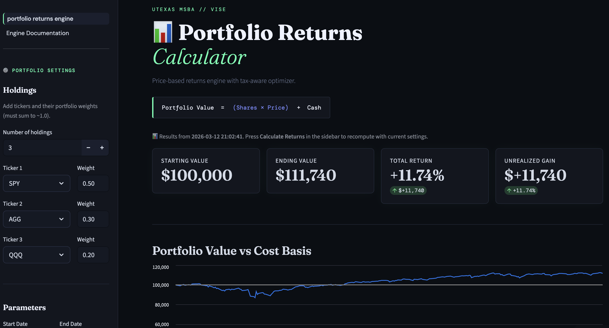

[](https://portfolio-tlh-optimizer.streamlit.app)

# Portfolio Returns Calculator

### Tax-Aware Portfolio Rebalancing and Tax-Loss-Harvesting Simulation Engine

**Live app:** https://portfolio-tlh-optimizer.streamlit.app



---

## Project Overview

The **Portfolio Returns Calculator** is a tax-aware portfolio simulation engine wrapped in an
interactive Streamlit dashboard. It lets you configure holdings, target weights, tax rates, a
rebalancing strategy (calendar, drift-band, or hybrid), a tax-loss-harvesting (TLH) threshold, and
transaction costs, then reports after-tax performance and risk metrics, lot-level diagnostics, and a
side-by-side strategy comparison. A separate combinatorial backtest compares TLH against no-TLH across
market regimes and portfolios and produces a ranked strategy playbook.

This was the **UT Austin MSBA capstone for Vise (Group 20)**. Vise builds and explains automated,
personalized portfolios for financial advisors. Its production tax-loss harvesting is a commercial
differentiator, but advisors find it hard to explain *why* a specific trade fired. Our goal was a
transparent, rules-based, lot-level engine that quantifies the value of TLH across strategies, portfolios,
and market environments, and produces an auditable trade log an advisor can actually explain to a client.

Core capabilities:

- Lot-level, tax-aware portfolio simulation with short-term / long-term gain classification
- Tax-loss-harvesting engine with IRS wash-sale enforcement and automatic proxy substitution
- Flexible rebalancing: calendar (monthly / quarterly / yearly) and drift-band (absolute / relative)
- After-tax performance and risk analytics (CAGR, Sharpe, max drawdown, tracking error, information ratio, Calmar)
- A 384-run comparative backtest and a ranked strategy playbook
- Interactive Streamlit dashboard with a dark, terminal-style theme and Excel export

---

## Headline Results

The backtest runs **192 matched TLH-vs-no-TLH comparisons** (**384 individual simulations**):
**4 portfolios x 6 market periods x 8 rebalancing strategies x {TLH on, TLH off}**, each on a $1M
portfolio with 35% short-term / 20% long-term tax rates, 12 bps round-trip cost, a 10% TLH loss threshold,
and a 30-day wash-sale rule. Returns are on a price basis so that every strategy is compared on the same
footing (see Limitations).

**The central finding: tax-loss harvesting is a reliable tax tool whose bottom-line value is decided by the
wash-sale replacement.**

- TLH **cut taxes in 86% of comparisons** (about **+$10,182 per $1M** on average).
- But to stay invested after harvesting a loss, the strategy must hold a **replacement ETF**, and the
  tracking gap between the original holding and its replacement, compounded over the holding period, usually
  moves portfolio value more than the tax saving does.
- Net of tax, tracking, and cost, harvesting helped in **55%** of comparisons pre-liquidation and **37%**
  after a full liquidation.

**Net after-tax value-add of harvesting, decomposed by portfolio** (mean per $1M):

| Portfolio | Tax saved | Replacement tracking | Extra cost | Net value-add |
|---|---|---|---|---|
| 3-ETF (SPY/TLT/GLD) | +$17,973 | +$15,371 | -$3,009 | **+$30,335** |
| 2-ETF (IVV/EFA) | +$8,860 | +$9,277 | -$2,259 | **+$15,879** |
| 40/60 (TA ETF) | +$8,524 | -$18,761 | -$3,038 | **-$13,275** |
| 100/0 (TA ETF) | +$5,370 | -$28,588 | -$3,272 | **-$26,490** |

Tax saved is positive for every portfolio, so as a tax tool TLH works. **The net result is decided by
replacement tracking.** The two model-ETF portfolios map several large-cap growth sleeves (S&P 500 Growth,
Russell 1000 Growth) to a broad **S&P 100** substitute that lagged by hundreds of percentage points over the
long windows, so the harvested portfolio spends years holding the wrong index. The single worst run (100/0,
20-year, Abs-10%) was **-$492,226**, of which **-$410,475 was replacement tracking** and only -$73,185 was
tax. The best (3-ETF, 20-year, Abs-10%) was **+$210,784**, but it was tracking-dominated too (+$184,832
tracking, only +$31,924 tax). Single-run extremes reflect replacement tracking in both directions, so the
reliable, repeatable effect is the tax saving (positive in 86% of runs), not any single headline number.

Two practical conclusions:

1. **Replacement-ETF quality is the most important lever.** Style-matched substitutes (growth to growth,
   value to value) would materially improve the harvested portfolios. The large negative results came from
   poor replacements, not the tax mechanics.
2. **Less churn wins.** Relative-25%, absolute-20%, and yearly rebalancing rank best; **monthly rebalancing
   ranks worst overall** (and in four of the six market periods). Much of the in-flight tax benefit is also
   deferral, which shrinks at liquidation.

The full ranked recommendations and the per-run decomposition live in `Backtest/strategy_playbook.xlsx`.

---

## Running the App

The deployed app is live at **https://portfolio-tlh-optimizer.streamlit.app**. To run it locally:

```bash
pip install -r requirements.txt
streamlit run portfolio_returns_engine.py
```

The dashboard opens at `http://localhost:8501`. The full price history ships with the repo as a compact
parquet (`data/price_data.parquet`, ~14 MB), so the app runs from a clean clone with no external download.

---

## Reproducing the Backtest

```bash
python Backtest/run_backtest.py        # writes Backtest/comparative_analysis_results.csv (384 rows)
python Backtest/build_playbook.py      # writes Backtest/strategy_playbook.xlsx (4 sheets)
```

`run_backtest.py` runs every portfolio x period x strategy x TLH combination through the same lot-level
engine and takes well under a minute on a laptop. Pass `--dividends` to model dividend reinvestment
(DRIP, total-return) instead of the default price basis. The narrated walk-through is in
`Backtest/vise_comparative_analysis.ipynb`.

---

## Project Structure

```
portfolio-tlh-optimizer/
|
|-- engine/                            # Pure computation package (no Streamlit dependency)
|   |-- __init__.py                    # Re-exports all public functions
|   |-- core.py                        # validate_weights, calculate_portfolio_returns, build_*
|   |-- rebalancing.py                 # Calendar + drift-band rebalancing engines
|   |-- metrics.py                     # compute_strategy_metrics (CAGR, Sharpe, Calmar, TE, IR)
|
|-- portfolio_returns_engine.py        # Streamlit app (imports from engine/, renders UI)
|-- optimizer_msba_v1_engine.py        # Lot-level tax-aware TLH engine (wash-sale, carryforward, DRIP)
|-- ui_style.py                        # Dark terminal theme + CSS helpers
|-- pages/01_Engine_Documentation.py   # In-app engine documentation
|
|-- Backtest/
|   |-- run_backtest.py                # Reproducible 384-run backtest (source of truth)
|   |-- build_playbook.py              # Builds strategy_playbook.xlsx from the results
|   |-- vise_comparative_analysis.ipynb        # Narrated main analysis (4 portfolios)
|   |-- vise_comparative_analysis_full.ipynb   # Scaled sweep across all model portfolios
|   |-- comparative_analysis_results.csv       # 384-run results (output)
|   |-- strategy_playbook.xlsx                 # Ranked recommendations (output)
|   |-- outputs/                       # Per-portfolio splits and figures
|   |-- archive/                       # Earlier exploratory notebooks
|
|-- data/                              # price_data.parquet, dividend_data.csv, proxy_lookup, Models.xlsx, guides
|-- scripts/prepare_data.py            # Rebuilds data/ from the raw CSV extract
|-- report/                            # Final report, executive summary, slides, planning + reading docs
|-- test_msba_engine.py, conftest.py   # Pytest suite (imports engine/ directly)
|-- requirements.txt, .github/workflows/ci.yml
```

### Data flow

```
data/price_data.parquet ---> load_data() / prepare_price_data()
                                     |
            +------------------------+-------------------------+
            v                        v                         v
     engine/core.py          engine/rebalancing.py    optimizer_msba_v1_engine.py
  calculate_portfolio_returns build_rebalanced_series  run_optimizer_simulation
  build_daily_series          build_threshold_series   (lot tracking, TLH, wash-sale, DRIP)
            |                        |                         |
            +------------------------+-------------------------+
                                     |
                              engine/metrics.py
                          compute_strategy_metrics
                                     |
                      portfolio_returns_engine.py (Streamlit UI)
```

---

## Data

All datasets are S&P Capital IQ / Vise market data covering ETF prices, dividends, splits, TLH proxy
mappings, and model portfolios. The full price history is committed as a 14 MB parquet, so nothing needs to
be downloaded. To rebuild the data files from the raw CSV extract (for example to refresh them):

```bash
python scripts/prepare_data.py --raw /path/to/raw/Data
```

This converts the ~545 MB `price_data.csv` to the committed parquet and adds a `TICKERSYMBOL` column to the
dividend file. The raw CSV itself is git-ignored because of its size.

---

## What This Project Demonstrates

| Skill | Implementation |
|---|---|
| Tax-aware portfolio simulation | Lot-level accounting: ST/LT classification, loss carry-forward, $3k ordinary offset, annual settlement |
| Wash-sale modeling | 30-day lookback and 30-day forward block with automatic proxy substitution |
| Rebalancing strategy comparison | Buy-and-hold, calendar, and drift-band, all on the same net-of-cost basis |
| Financial metrics | CAGR, annualized volatility, Sharpe, max/avg drawdown, tracking error, information ratio, Calmar |
| Reproducible research | One command regenerates every reported number; results feed the report, slides, and playbook |
| Engineering | Engine separated from UI, cached data loading, a green CI that runs the test suite |

---

## Modeling Assumptions and Limitations

| Assumption | Detail |
|---|---|
| **Net value-add metric** | The headline "net value-add" is the harvested portfolio's value minus an identical no-harvest portfolio's, decomposed into tax saved, replacement-ETF tracking, and extra cost. It is dominated by replacement tracking, not tax, so it is reported and decomposed as net value-add rather than as pure "tax alpha" (the app and code keep the conventional "tax alpha" label, clarified in-app). Results therefore depend heavily on the supplied replacement-ETF map. |
| **Full sweep** | The optional `--full` sweep (158 model portfolios) renormalizes each portfolio to tickers with price history; some hold mutual funds absent from the ETF dataset, so it is a directional robustness check. The four headline portfolios have full ticker coverage and are unaffected. |
| **Returns basis** | The reported backtest is price-return. Running every strategy (TLH on and off, calendar and threshold) through the same engine on the same basis keeps the comparison apples-to-apples. The app can additionally model dividends and DRIP (`--dividends` in the backtest). |
| **Transaction costs** | 12 bps round-trip (5 commission + 5 slippage + 2 bid-ask), embedded in NAV on every trade. |
| **Sharpe ratio** | Defined as CAGR / annualized volatility with a 0% risk-free rate. This is internally consistent for ranking but differs from the textbook mean-excess-return Sharpe. |
| **ST/LT classification** | IRS "more than one year" rule: 366 or more calendar days held is long-term. |
| **Wash-sale** | 30-day lookback and 30-day forward block; replacement ETFs come from `proxy_lookup.csv`. |
| **Dividend timing** | Uses `PAYDATE` rather than `EXDATE`, a small timing simplification. |
| **Survivorship bias** | The price universe covers active tickers, so single-security history may be biased upward. |
| **Other** | Fractional shares; long-only (no margin or shorting); federal ST/LT capital gains and the $3k ordinary offset only (no state or local taxes). |

A key takeaway from the results is that harvesting reliably saves tax, but its net value is gated by
**replacement-ETF tracking** and shrinks at liquidation (much of the in-flight benefit is deferral). It can
turn net-negative when the wash-sale substitute tracks the original poorly over a long hold.

---

## Engine Documentation

The in-app **Engine Documentation** page (in the sidebar) covers the simulation loop, ST vs LT tax
handling and carry-forward netting, sell handling and TLH lot selection (FIFO / LIFO / tax-optimal),
dividends and cashflows, and valuation and edge cases.

---

## Technology Stack

| Layer | Libraries |
|---|---|
| UI | Streamlit, custom CSS |
| Data | pandas, NumPy, PyArrow |
| Analytics | SciPy, Plotly, Matplotlib |
| Backtest | joblib (parallel) |
| Export | openpyxl |
| CI | GitHub Actions (Python 3.11, pytest, flake8) |

---

## Team

UT Austin MS Business Analytics Capstone, Group 20, sponsored by Vise (sponsor: Brandt Green).

Bhagya Puppala, Jack Feen, Joshua Ringler, Nathan Arimilli, Nisha Sapkota, Rio Yokoyama.

---

## License

[MIT License](LICENSE)
